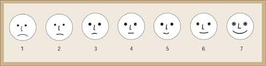

::: callout-note
## Credits

-   Dispensa [Testing
    psicologico](https://ccaudek.github.io/testing_psicologico/) by
    Corrado Caudek
    
-   Brown, Anna. (2023). Psychometrics in Exercises using R and RStudio. Textbook and data resource. Available from <https://bookdown.org/annabrown/psychometricsR>.

-   Altoè, G. (2022). Corso di Testing Psicologico, Scienze psicologiche dello
sviluppo, della personalità e delle relazioni interpersonali, A.A. 2022/23

- Marci, M. (2025). Corso di Testing Psicologico, Scienze psicologiche dello
sviluppo, della personalità e delle relazioni interpersonali, A.A. 2025/26

Altri riferimenti utili sono:

-   Petersen, I. T. (2026). Principles of psychological assessment: With
    applied examples in R. Version 1.0.9. University of Iowa Libraries.
    <https://isaactpetersen.github.io/Principles-Psychological-Assessment>.
    <https://doi.org/10.25820/work.007199>

-   Martinková, P., & Hladká, A. (2023). Computational Aspects of
    Psychometric Methods: With R (1st ed.). Chapman and Hall/CRC.
    <https://doi.org/10.1201/9781003054313>
:::

# Misurazione in psicologia

## Il concetto di misura

::: callout-note
## Definizione

Processo di assegnazione di numeri o simboli a proprietà di oggetti, eventi o fenomeni, seguendo regole definite e condivise per rappresentarne quantitativamente le proprietà e consentirne la descrizione, il confronto e l'analisi.
:::

Vanno distinte le **quantità** dalle **qualità** delle unità di analisi:

| Quantità | Qualità |
|---|---|
|   **Misurazione** | **Rilevazione** |
|   esprime una manifestazione particolare della quantità | si esprime con simboli (anche numerici), ma i numeri non esprimono misure di quantità |
| Esempio | La larghezza della cattedra è una misura della quantità "lunghezza" | Luogo di nascita degli studenti di questa classe |

La misurazione implica una relazione tra due sistemi:

- **Sistema relazionale numerico**: i numeri naturali con le loro proprietà → stabilire una relazione d'ordine ($>$, $<$, $=$) e operazioni
- **Sistema relazionale empirico**: le proprietà degli oggetti

Questi due sistemi sono collegati da una **regola** di misurazione.

### Un esempio

Il bastoncino $a$ è lungo il doppio del bastoncino $b$:

$$b = \frac{1}{2}a \quad \text{oppure} \quad a = 2b$$

Se aggiungiamo una costante $k$ ad $a$ e $b$, il rapporto tra $a$ e $b$ non cambia. Il sistema relazionale numerico è in relazione diretta con il sistema relazionale empirico.

**Le variabili psicologiche non fanno parte del sistema relazionale empirico!** Come si possono quantificare? Come si possono misurare?

## Variabili osservate vs. Variabili latenti

- Variabili che **non possono essere osservate direttamente** → **Variabili latenti** (es. Intelligenza)
- Inferite da indicatori osservabili direttamente → **Variabili osservate** (es. risposte alle Matrici di Raven)

L'*operazionalizzazione* della variabile latente è cruciale.

Le variabili latenti devono essere collegate alle variabili osservate attraverso modelli matematici e statistici.

**Assunzioni:**

- Le variabili latenti sono la causa sottostante delle variabili osservate
- **Indipendenza locale**: la correlazione tra variabili osservate scompare dopo aver controllato l'influenza della variabile latente

La leadership, per esempio, non si può vedere né toccare — **non si può osservare direttamente** → non è nel sistema relazionale empirico.

Quello che si può vedere direttamente sono i **comportamenti** che possono essere ricondotti alla leadership → sono nel sistema relazionale empirico e si possono misurare.

Si "traduce" la definizione teorica di una variabile/caratteristica psicologica in qualcosa di osservabile → i comportamenti (che possono anche essere le risposte a un questionario!).

## Operazionalizzazione

Si tratta della "traduzione" in comportamenti osservabili ed oggettivi di variabili latenti psicologiche *non direttamente osservabili*.

La definizione teorica del costrutto è di vitale importanza per la definizione dei comportamenti osservabili ad esso legati: la misurazione del costrutto dipende proprio da questi!

::: callout-note
## Dominio di contenuto

Universo dei possibili comportamenti che, coerentemente con la definizione, possono rappresentare le operazionalizzazioni del costrutto.

Quando è molto ampio → *facets*
:::

### Esempio: Estroversione

**Definizione**: L'estroversione è un tratto di personalità caratterizzato da socievolezza, assertività, livello elevato di attività, ricerca di stimoli ed esperienza di emozioni positive *(Costa & McCrae, 1992)*.

| Facets | Aggettivi prototipici |
|---|---|
| Socievolezza | Socievole |
| Assertività | Deciso |
| Attività | Energico |
| Ricerca di stimoli | Avventuroso |
| Emozioni positive | Entusiastico |
| Espansività | Espansivo |

### Esempio: Leadership

**Definizione**: La leadership è il processo attraverso cui un individuo influenza un gruppo di persone al fine di raggiungere un obiettivo comune *(Northouse, 2021)*.

| Facets | Aggettivi prototipici |
|---|---|
| Influenza sociale | Persuasivo |
| Visione | Ispiratore |
| Decisione | Determinato |
| Gestione del gruppo | Coordinatore |
| Motivazione | Coinvolgente |
| Responsabilità | Affidabile |

### Esempio: Triade Oscura

Alcuni costrutti di personalità sono concettualizzati come dimensioni relativamente unitarie, senza una struttura gerarchica stabile composta da facets.

Un esempio è la **Triade Oscura della personalità**, composta da:

- **Machiavellismo**: caratterizzato da manipolazione interpersonale, cinismo, distacco emotivo e orientamento strategico al raggiungimento dei propri obiettivi
- **Narcisismo**: caratterizzato da grandiosità, bisogno di ammirazione, senso di superiorità e forte focalizzazione su sé stessi
- **Psicopatia subclinica**: caratterizzata da impulsività, ridotta empatia, scarsa ansia e tendenza a comportamenti antisociali non necessariamente clinici

*(Paulhus & Williams, 2002)*

## Tipi di variabili

**QUALITATIVE / CATEGORIALI**

- Sconnesse: $\{a, b, c\}$
- Ordinate: $\{a, b, c\}$ con $a < b < c$ (oppure $a > b > c$)

**QUANTITATIVE / METRICHE**

- Discrete: $\mathbb{Z}$
- Continue: $\mathbb{R}$

## Scale di misura (Stevens, 1946)

Le variabili si differenziano in base alla quantità di informazione che può essere ricavata:

### Scala nominale

Distingue un insieme di dati in diverse categorie. Vale solo l'equivalenza ($=$ o $\neq$).

Esempi: Comune di residenza, genere, patologia clinica.

Al posto di "A", "B", "C" si poteva scrivere $\alpha$, $\beta$, $\gamma$, 1, 2, 3 (ma i numeri valgono solo come etichette!).

Caratteristiche:

- Categorie **distintive**: gli elementi che appartengono a categorie differenti vengono considerati di tipo diverso
- Categorie **mutualmente escludentesi**: ogni elemento può rientrare in una ed una sola categoria
- Categorie **collettivamente esaustive**: tutti gli elementi vengono classificati nelle categorie della variabile, nessuno escluso

### Scala ordinale

Distingue un insieme di dati in diverse categorie che sono ordinabili a seconda della quantità di caratteristica posseduta. Vale sia l'equivalenza ($=$ o $\neq$) sia l'ordinamento ($<$ o $>$).

Esempi: Titolo di studio, gradimento di un prodotto, valutazione di una malattia (alto, medio, basso).

Le etichette numeriche valgono per il loro ordine (non ha senso compiere operazioni tra di loro).

### Scala a intervalli equivalenti

Lo $0$ è arbitrario, ma c'è un'unità di misura per cui le categorie si trovano alla stessa distanza. Vale equivalenza ($=$ o $\neq$), ordinamento ($<$ o $>$) e differenza ($+$ o $-$).

Esiste una relazione d'ordine tra le quantità e la distanza tra le quantità e nota e definita da una unità di misura costante e **nota**.

Esempi: Temperatura in Celsius, Q.I., scale di atteggiamento.

Se ci sono 0°C, non vuol dire che non c'è calore!

Prendiamo due temperature, $T_a$ e $T_b$. Queste temperature in Celsius $C$ sono $T_a(C) = 5$ e $T_b(C) = 10$.

Quello che si può dire: 

* $T_a(C) < T_b(C)$ (oppure $T_b(C) > T_a(C)$)
* $T_b(C) - T_a(C) = 5$
* Non possiamo dire che $T_b(C) = 2T_a(C)$.

Infatti, volendo trasformare le due temperature in Fahrenheit tramite la relazione

$$F = \dfrac{9}{5}C + 32$$
si vedrebbe che $T_a(F) = \dfrac{9}{5}5 + 32 = 41$ e $T_a(F) = \dfrac{9}{5}10 + 32 = 50$. 
Rimane la relazione d'ordine, per cui anche $T_a(F) < T_b(F)$, ma cambia sia la differenza tra le due quantità $T_b(F) - T_a(F) = 9$ sia la relazione tra le due, per cui si vede chiaramente che $T_a(F) \neq T_b(F)$.

### Scala a rapporti equivalenti

Lo $0$ è assoluto: indica assenza del fenomeno. Vale equivalenza ($=$ o $\neq$), ordinamento ($<$ o $>$), differenza ($+$ o $-$) e rapporto ($\times$ o $\div$).

Esempi: Peso, altezza, valori diagnostici.

La presenza dello 0 assoluto permette di andare oltre la mera relazione d'ordine e distanza tra le quantità.

Si prendano ad esempio due pesi, $P_a$ e $P_b$. 
Questi pesi, misurati in chilogrammi $K$, sono $P_a(K)= 10$ e $P_b(K) = 30$. 
Quello che si può dire: 

* $P_a(K) < P_b(K)$ ($P_b(K) > P_a(K)$)
* $P_b(K) - P_a(K) = 20$
* Ma soprattutto $P_a(K) = \dfrac{1}{3}P_b(K)$ oppure $P_b(K) = 3P_a(K)$

La relazione tra $P_a$ e $P_b$ rimane **invariante** attraverso le diverse trasformazioni di scala. 

Ad esempio, trasformando $P_a(K)$ e $P_b(K)$ in libbre ($L$) mediante la relazione

$$L = K \times 2.20462$$
per cui $P_a(L) = 10 \times 2.20462 = 22.0462$ e $P_b(L) = 20 \times 2.20462 = 44.0924$. La relazione d'ordine è matenuta e, al netto dei decimali, rimane anche invariante il rapporto tra i due pesi.


# Descrittive di Base

**Statistica descrittiva:**

- Riassume, descrive, esplora i dati osservati
- Prima fase nella valutazione delle proprietà psicometriche di uno strumento

**Statistica inferenziale:**

- Usa i dati di un **campione** per fare inferenze sulla **popolazione**
- Confronti tra gruppi, valutazione di interventi, validazione di test

```{r, include=FALSE}
burnout <- read.csv("data/burnout.csv")
library(dplyr)
library(ggplot2)
library(psych)
theme_set(theme_classic())
```

## Frequenze

**Notazioni fondamentali:**

- Sia $X$ la variabile di interesse
- Sia $X_i$ la categoria/livello $i$-esima di $X$
- Sia $n$ il totale delle unità statistiche

### Frequenze assolute semplici

La frequenza assoluta semplice di una categoria è il **numero naturale di unità statistiche** che presentano tale categoria.

$$f_i \geq 0, \quad \sum_{i=1}^{k} f_i = n$$

```{r}
# Esempio: frequenze assolute semplici
fi <- table(burnout$StressLevel)
fi
```

### Frequenze assolute cumulate

La frequenza assoluta cumulata di una categoria è la **somma** delle frequenze assolute semplici delle categorie precedenti più la frequenza assoluta semplice della categoria data.

$$F_i = f_1 + f_2 + \ldots + f_i = \sum_{j=1}^{i} f_j$$

```{r}
Fi <- cumsum(table(burnout$StressLevel))
Fi
```

::: callout-important
Le frequenze cumulate si calcolano **solo** quando le categorie di una variabile presentano un ordinamento (quindi non si calcolano per variabili misurate a livello nominale).
:::

### Frequenze relative semplici

La frequenza relativa semplice è data dal rapporto tra la frequenza assoluta semplice di tale categoria e il numero totale di unità statistiche osservate.

$$f_i\% = \frac{f_i}{n} \cdot 100 \quad (0 \leq f_i\% \leq 100, \quad \sum_{i=1}^{k} f_i\% = 100)$$

```{r}
n <- nrow(burnout)
pi_rel <- table(burnout$StressLevel) / n
round(pi_rel, 3)
```

**Una frequenza relativa semplice varia sempre tra 0 e 1.**

### Frequenze relative cumulate

La frequenza relativa cumulata è la somma delle frequenze relative semplici delle categorie precedenti più la frequenza relativa semplice della categoria data.

```{r}
Pi <- cumsum(table(burnout$StressLevel) / n)
round(Pi, 3)
```

**Una frequenza relativa cumulata varia sempre tra 0 e 1.**

## Indici di tendenza centrale

Un indice di tendenza centrale è un valore che descrive e riassume il centro di una distribuzione di dati.

| Indice | Variabile nominale | Variabile ordinale | Variabile quantitativa |
|:--|:--:|:--:|:--:|
| Moda | SI | SI | SI |
| Mediana | NO | SI | SI |
| Media | NO | NO | SI |

### La moda

La moda di una distribuzione è la categoria che si presenta con la **massima frequenza**:

$$Mo(X) = \max(f_i)$$

Si può calcolare per le variabili misurate a qualsiasi livello, anche se di fatto viene calcolata solo per le variabili categoriali.

### La mediana

La mediana è il dato che occupa la **posizione centrale** rispetto alla distribuzione ordinata dei dati:

- preceduta da almeno 50% dei casi
- superata da almeno 50% dei casi

La posizione della mediana è:

$$Pos_{Me} = \frac{n+1}{2}$$

Per individuarla sulla distribuzione di frequenza, si cerca la prima frequenza cumulata maggiore o uguale alla posizione cercata.

```{r}
median(as.numeric(burnout$StressLevel))
```

### La media aritmetica

La media aritmetica è data dalla somma dei dati divisa per il numero di unità statistiche:

$$\bar{X} = \frac{\sum_{i=1}^{n} x_i}{n}$$

La media è una sorta di baricentro della distribuzione dei dati. È sensibile ai valori estremi (outlier).

```{r}
mean(burnout$Age)
```

## Indici di variabilità

Il concetto di variabilità si riferisce a quanto i punteggi di una distribuzione sono sparsi, ovvero quanto siano simili o dissimili tra loro.

- Il ricorso a un indice di tendenza centrale (come la media) comporta una forte semplificazione
- È fondamentale capire quanto i dati siano dispersi intorno all'indice di tendenza centrale
- La variabilità è una caratteristica fondamentale delle distribuzioni: *"Variability is the essence of statistics"* (Cobb, 1992)

Gli indici di variabilità possono assumere solo valori positivi (non ha senso parlare di dispersione negativa) o nulli (quando i dati hanno tutti lo stesso valore).

### Campo di variazione (Gamma)

Il campo di variazione è la differenza tra il valore massimo e il valore minimo osservato:

$$\text{gamma} = X_{max} - X_{min}$$

```{r}
team_A <- c(38, 42, 44, 36, 39, 42, 38, 41)
max(team_A) - min(team_A)
```


:::{.callout-caution}
## Limitazione

Dipende solo da due valori (massimo e minimo) e non considera la distribuzione dei dati intermedi.
:::


### La varianza

La varianza $\sigma^2$ è la media degli scarti al quadrato tra i dati e la media:

$$\sigma^2 = \frac{\sum_i^n (X_i - \bar{X})^2}{n}$$

La varianza assume valore minimo $0$ quando tutti i dati sono uguali tra loro e aumenta all'aumentare della dispersione.

::: callout-important
La funzione `var()` di R calcola la **varianza campionaria**, che divide per $n-1$ anziché $n$. Per dati descrittivi (popolazione osservata) si usa $n$; per stimare la varianza della popolazione da un campione si usa $n-1$.
:::

### La deviazione standard

La deviazione standard è la radice della varianza:

$$\sigma = \sqrt{\sigma^2}$$

Riporta l'indice di variabilità sulla **scala della variabile**.

Esempio: Se in un campione di dipendenti la variabile `WorkHoursPerWeek` ha media $40$ ore e deviazione standard $2.5$, i dipendenti differiscono mediamente di $2.5$ ore dal carico di lavoro medio.

### Il coefficiente di variazione

Il coefficiente di variazione è il rapporto tra la deviazione standard e il valore assoluto della media:

$$CV = \frac{\sigma}{|\bar{X}|}$$

Il CV è un indice di **variabilità relativa** fondamentale per eseguire **confronti** tra fenomeni misurati su **scale diverse**.

```{r}
media_esp <- abs(mean(burnout$Experience))
sd_esp    <- sd(burnout$Experience)
media_ore <- abs(mean(burnout$WorkHoursPerWeek))
sd_ore    <- sd(burnout$WorkHoursPerWeek)

cv_esp <- sd_esp / media_esp
cv_ore <- sd_ore / media_ore

round(cv_esp, 2)
round(cv_ore, 2)
```

### I quantili e la differenza interquartilica (IQR)

La differenza interquartilica è la differenza tra il terzo e il primo quartile:

$$IQR = Q_{75} - Q_{25}$$

L'IQR misura la dispersione del 50% centrale dei dati ed è un indice **robusto** perché i valori estremi incidono poco o per nulla.

**Outlier:** valori oltre $[Q_1 - 1.5 \times IQR \;;\; Q_3 + 1.5 \times IQR]$.

```{r}
Q1 <- quantile(burnout$Experience, prob = 0.25)
Q3 <- quantile(burnout$Experience, prob = 0.75)
differenza_iqr <- Q3 - Q1
limite_inferiore <- Q1 - (1.5 * differenza_iqr)
limite_superiore <- Q3 + (1.5 * differenza_iqr)
```

Il **boxplot** visualizza Q1, mediana, Q3 e gli outlier in un unico grafico.

## I percentili

Il **percentile $x_p$ di ordine $p$** è quella categoria/valore che è:

- preceduta da almeno $p\%$ dei casi
- superata da almeno $(1-p)\%$ dei casi

| Tipo | Ordine |
|---|---|
| Quartili | percentili di ordine 25 - 50 - 75 |
| Decili | percentili di ordine 10 - 20 - ... - 90 |
| Percentili | percentili di ordine 1 - 2 - ... - 98 - 99 |

```{r}
quantile(burnout$SatisfactionLevel, probs = c(0.05, 0.25, 0.50, 0.75, 0.95))
```

### Rango percentile

Il **rango percentile** ($Rp$) indica la **percentuale di casi** che hanno un valore uguale o inferiore a un particolare punteggio $X_i$:

$$Rp = \frac{B}{N} \times 100$$

dove $B$ è il numero di casi $\leq X_i$ e $N$ è il numero totale di casi.

## Indici di forma

Gli indici di forma descrivono **come** è distribuita una variabile, oltre alla sua posizione centrale e dispersione. Due distribuzioni possono avere stessa media e deviazione standard ma **forma diversa**.

### Asimmetria (Skewness)

L'**asimmetria** misura quanto una distribuzione si discosta dalla simmetria rispetto al centro.

| Tipo | Valore indice | Caratteristiche |
|:-----|:-----:|:----------------|
| **Simmetrica** | $\approx 0$ | Media = Mediana = Moda |
| **Asimmetria positiva** | $> 0$ | Moda < Mediana < Media |
| **Asimmetria negativa** | $< 0$ | Media < Mediana < Moda |

```{r}
library(psych)
skew(burnout$WorkHoursPerWeek)
```

Interpretazione: valore vicino a 0 indica distribuzione approssimativamente simmetrica.

### Curtosi (Kurtosis)

La curtosi misura quanto i dati si **concentrano nelle code** della distribuzione. Molti software riportano l'**eccesso di curtosi** rispetto alla distribuzione normale (il cui valore di curtosi è 3):

| Tipo | Valore indice | Forma |
|:-----|:-------------:|:------|
| **Mesocurtica** | $\approx 0$ | Forma normale |
| **Leptocurtica** | $>0$ | Code pesanti |
| **Platicurtica** | $<0$ | Code leggere |

```{r}
kurtosi(burnout$WorkHoursPerWeek)
```

# Probabilità

## La distribuzione normale

Si presuppone che la caratteristica misurata abbia una **distribuzione nota** nella popolazione. Di solito si assume una **distribuzione normale**: la maggior parte degli individui ha quantità *intermedie* della caratteristica, quindi pochi individui si collocano agli estremi.

La distribuzione normale è definita da due parametri:

- $\mu$ (la media)
- $\sigma^2$ (la varianza)

## Standardizzazione e taratura

1. Raccogliere i punteggi grezzi sul campione normativo
2. Stimare i parametri della distribuzione ($\mu$, $\sigma$)
3. Trasformare i punteggi in scale standardizzate
4. Produrre le **tavole di conversione** grezzi → standardizzati

**Scale comuni:** percentili, punti Z, punteggi T...

::: callout-note
## Il campione normativo

> Il campione normativo è il gruppo di soggetti le cui risposte al test costituiscono il termine di riferimento per valutare qualsiasi soggetto sottoposto successivamente al test.

- **Rappresentatività** — rispecchia la popolazione target
- **Ampiezza** — migliaia di soggetti per ridurre l'errore di stima

Un buon manuale deve descrivere le caratteristiche del campione normativo.
:::

## Punteggi grezzi e standardizzati

- **Punteggi grezzi**: valori raccolti direttamente dal test; non interpretabili direttamente
- **Standardizzazione**: trasformazione in valori interpretabili e confrontabili

### Formula generale

La trasformazione lineare che riscala $X$ verso una distribuzione target:

$$Y = (X - \bar{X})\frac{s_Y}{s_X} + \bar{Y}$$

dove $\bar{Y}$ e $s_Y$ sono la media e deviazione standard target:

| Scala | $\bar{Y}$ | $s_Y$ |
|:---|:---:|:---:|
| Punteggi T | 50 | 10 |
| QI | 100 | 15 |
| Punteggi Z | 0 | 1 |

### Il punto Z

Se la distribuzione target ha $\bar{Y} = 0$ e $s_Y = 1$:

$$Z = \frac{X - \bar{X}}{s_X}$$

Dove:

- $X$ è il punteggio grezzo
- $\bar{X}$ è la media della popolazione
- $s_X$ è la deviazione standard della popolazione

Esprime la **distanza di $X$ dalla media in unità di deviazioni standard**.

- Z = $-1.96$ significa che il soggetto ha ottenuto un punteggio di 1.96 deviazioni standard **inferiore** rispetto al punteggio medio della popolazione
- Nel caso in cui la distribuzione dei punteggi sia approssimativamente normale, i punti Z possono essere utilizzati per interpretare direttamente le prestazioni dei soggetti

I punteggi standardizzati permettono di confrontare misure su **scale diverse**, portandole tutte sulla **stessa unità di misura**.

## La probabilità

### Introduzione

- In termini generali, la **probabilità** può essere vista come il grado di **fiducia** rispetto al manifestarsi di un evento
- La probabilità è una misura matematica che serve ad esprimere la nostra **incertezza**
- È un numero sempre compreso tra 0 e 1: dove 0 indica un evento impossibile e 1 indica un evento certo

Un esempio classico è il lancio di una moneta equa: la probabilità di ottenere testa è $\frac{1}{2}$. In una singola serie di lanci potremmo ottenere più o meno del 50% di teste, ma all'aumentare del numero di lanci la frequenza relativa si avvicina sempre di più a $\frac{1}{2}$.

### Spazio campionario, esiti ed eventi

Dato un fenomeno casuale, l'insieme di **tutti i possibili esiti** è detto **spazio campionario** $S$. Gli elementi di $S$ devono essere:

- **Mutuamente esclusivi**: due esiti non possono verificarsi contemporaneamente, $A \cap B = \emptyset$
- **Collettivamente esaustivi**: insieme coprono tutti i casi possibili, $A \cup B = S$

Quando entrambe le condizioni valgono, diciamo che gli eventi costituiscono una **partizione** dello spazio campionario.

Un **evento** $E$ è semplicemente un sottoinsieme di $S$.

**Esempio 1: Moneta**

- Fenomeno: lancio di una moneta
- $S = \{\text{testa, croce}\}$
- Evento "esce testa": $E = \{\text{testa}\}$

**Esempio 2: Dado**

- Fenomeno: lancio di un dado a 6 facce
- $S = \{1, 2, 3, 4, 5, 6\}$
- Evento "numero pari": $E = \{2, 4, 6\}$

### Gli assiomi di Kolmogorov (1956)

La probabilità $P(\cdot)$ è una funzione che assegna un valore numerico a ogni evento:

1. $P(A) \geq 0$ — nessuna probabilità può essere negativa
2. $P(S) = 1$ — la somma delle probabilità di tutti gli esiti è 1
3. se $A \cap B = \emptyset$, allora $P(A \cup B) = P(A) + P(B)$

**Esempio: dado**

Poiché le sei facce sono equiprobabili: $P(1) = P(2) = \cdots = P(6) = a$. Per l'assioma 2: $6a = 1 \Rightarrow a = \frac{1}{6}$.

La probabilità di ottenere un numero pari è:

$$P(E) = P(2) + P(4) + P(6) = \frac{1}{6} + \frac{1}{6} + \frac{1}{6} = \frac{1}{2}$$

## Spazi campionari discreti e continui

| | **Discreto** | **Continuo** |
|---|---|---|
| **Definizione** | Esiti numerabili in categorie | Esiti su un continuum di valori |
| **Esempio** | Numero di errori: $S = \{0, 1, 2, \ldots\}$ | Tempo di risposta: $S = \{\theta > 0\}$ |
| **Probabilità** | $P(X = x) = f(x)$ | $P(a \leq X \leq b) = \int_a^b f(x)\,dx$ |

Nel caso **continuo**, la probabilità di un singolo valore esatto è sempre zero: ha senso solo chiedersi la probabilità di un **intervallo**. Questa probabilità si calcola come **area sotto una curva**.

## Variabili aleatorie e distribuzioni di probabilità

Una **variabile aleatoria** è una funzione $X : S \to \mathbb{R}$ che assegna un valore reale a ogni esito dello spazio campionario.

Esempio: nel lancio di una moneta, $X(\text{croce}) = 0$ e $X(\text{testa}) = 1$.

Una **distribuzione di probabilità** descrive quali valori può assumere $X$ e con che probabilità.

### Valore atteso

Il **valore atteso** è la media ponderata di tutti i valori possibili, con pesi dati dalle probabilità — ovvero il valore "tipico" nel lungo periodo:

$$E(X) = \sum_{x \in X(S)} x \times P(X = x)$$

Per un dado equo: $E(X) = \frac{1}{6}(1+2+3+4+5+6) = 3.5$.

### Varianza

La **varianza** misura quanto i valori si disperdono attorno alla media:

$$\text{Var}(X) = E\!\left[(X - E(X))^2\right]$$

Nella distribuzione normale, valore atteso e varianza corrispondono esattamente a $\mu$ e $\sigma^2$.

### Distribuzioni comuni

| Distribuzione | Supporto | $E[Y]$ | $\text{Var}(Y)$ |
|:--|:--|:--:|:--:|
| **Normale** $(\mu, \sigma^2)$ | $x \in \mathbb{R}$ | $\mu$ | $\sigma^2$ |
| **Gamma** $(\alpha, \lambda)$ | $x \in (0,\infty)$ | $\alpha/\lambda$ | $\alpha/\lambda^2$ |
| **Binomiale** $(n, p)$ | $x \in \{0,1,\dots,n\}$ | $np$ | $np(1-p)$ |
| **Poisson** $(\lambda)$ | $x \in \{0,1,2,\dots\}$ | $\lambda$ | $\lambda$ |

## La distribuzione normale standard

La **distribuzione normale standard** è una distribuzione di probabilità continua con spazio campionario $S = (-\infty, +\infty)$, media $\mu = 0$ e deviazione standard $\sigma = 1$.

- Un **evento** è un qualsiasi intervallo di valori: ad esempio $Z \geq 2$
- La **probabilità** di quell'evento è l'area sotto la curva in quell'intervallo
- L'area totale sotto la curva è uguale a 1

**Esempio:** l'area tra $z = -1$ e $z = +1$ è circa $0.68$: il 68% dei soggetti cade in questo intervallo.

### Dal punteggio Z alla probabilità

Se un punteggio PSWQ ha $z \geq 2$ e ci chiediamo quanto sia **raro** ottenere un punteggio del genere: dobbiamo calcolare l'**area sotto la curva** a destra di $z = 2$. Quella area **è** la probabilità: $P(Z \geq 2) \approx 0.023$.

Solo il **2.3%** della popolazione rientra in quella zona critica.

## Distribuzioni di probabilità in R

In R sono disponibili quattro funzioni per ogni distribuzione di probabilità:

- `d*`: calcola la **massa di probabilità** (discrete) o la **densità** (continue)
- `p*`: calcola la **probabilità cumulata** $P(X \leq q)$ dato un quantile
- `q*`: calcola il **quantile** dato un livello di probabilità cumulata
- `r*`: genera un **campione casuale** dalla distribuzione

dove `*` è il nome della distribuzione in R (es. `norm`, `binom`, `t`, ...).

| Distribuzione | Tipo | Nome R |
|:--|:--|:--|
| Binomiale | discreta | `binom` |
| Poisson | discreta | `pois` |
| Uniforme | continua | `unif` |
| Normale | continua | `norm` |
| t di Student | continua | `t` |

### Funzioni per la distribuzione normale

| Funzione | Cosa calcola |
|:--|:--|
| `dnorm(x, mean, sd)` | Densità in $x$ (altezza della curva, **non** una probabilità) |
| `pnorm(q, mean, sd)` | $P(X \leq q)$ — area a **sinistra** di $q$ |
| `qnorm(p, mean, sd)` | Il valore $x$ tale che $P(X \leq x) = p$ |
| `rnorm(n, mean, sd)` | Genera $n$ valori casuali dalla Normale |

::: callout-note
## `dnorm()`

`dnorm()` restituisce la **densità** in un punto, cioè l'altezza della curva. Per le distribuzioni continue, la densità **non è una probabilità**: la probabilità di un singolo valore esatto è sempre zero.

Per le distribuzioni **discrete** (es. Binomiale), `dbinom()` restituisce invece una vera probabilità: $P(X = x)$.
:::

```{r}
# Probabilità di punteggio >= 60, con mu=40, sd=10
pnorm(60, mean = 40, sd = 10, lower.tail = FALSE)

# Probabilità di punteggio compreso tra 30 e 50
pnorm(50, mean = 40, sd = 10) - pnorm(30, mean = 40, sd = 10)

# Quale punteggio corrisponde al 95° percentile?
qnorm(0.95, mean = 40, sd = 10)
```

# Test


:::: {.columns}

:::{.column width=50%}
::: callout-note
## British Psychological Society

A psychological test is any procedure on the basis of which inferences are made concerning a **person's capacity, propensity or liability** to act, react, experience, or to structure or order thoughts or behaviours in particular ways.
:::
:::

:::{.column width=50%}
::: callout-note
## Australian Psychological Society

A psychological test is a set of **standard items or stimuli**, the *responses to which form the basis* for an *inference* which goes *beyond item content* and for which psychologists accept *ethical responsibility* in professional use.
:::
:::
::::

:::{.callout-caution icon="false"}
## In comune

Andare oltre le risposte osservate per fare inferenza su delle variabili che non si possono osservare direttamente (**variabili latenti**)
:::

I test misurano alcuni aspetti del comportamento attraverso metodi di somministrazione, di scoring e di interpretazione altamente standardizzati e controllati. I comportamenti vengono registrati e interpretati secondo le procedure specifiche di ogni test $\rightarrow$ vengono espressi *sinteticamente* in un indice numerico.

Possono misurare diversi aspetti della persona:

- Emozioni, personalità, atteggiamenti ecc. → **test di prestazione tipica**
- Intelligenza, abilità → **test di prestazione massima**

Queste caratteristiche possono essere distinte in:

- **Tratti**: caratteristiche stabili della persona che difficilmente mutano con il tempo (o che richiedono molto tempo per cambiare)
- **Stati**: caratteristiche transitorie elicitate da particolari situazioni

## Perché i test?

La somministrazione di stimoli/domande standard predefiniti riduce gli effetti di distorsione dovuti ad elementi estranei.

L'analisi delle risposte è un processo aperto e standardizzato $\rightarrow$ replicabile da chiunque.

I test sono (devono essere):

- **Affidabili**: Costanti nella loro prestazione
- **Validi**: Misurano quello che dicono di misurare e non altro

## Come è fatto un test?

- **Manuale**: Contiene i riferimenti teorici (quadro teorico di riferimento) entro cui è stato sviluppato il test, le informazioni circa la popolazione target e il campione rappresentativo e normativo, le procedure utilizzate per lo sviluppo, le istruzioni di somministrazione, registrazione delle risposte, le procedure da usare per lo scoring e le norme per la trasformazione dei punteggi grezzi in punteggi standardizzati
- **Materiale stimolo**: Le domande/gli stimoli
- **Foglio di notazione**: per registrare le risposte
- **Griglia per la correzione**: come ottenere i punteggi

## A cosa servono?

I test servono a ottenere dai soggetti delle prestazioni nella situazione contingente (attenzione!). A partire da quelle prestazioni si dovrebbe poter arrivare a una *generalizzazione* al comportamento *fuori dalla situazione sperimentale*, permettendo quindi previsioni relative alla vita quotidiana.

In particolare, servono a:

- Fare valutazioni (rispetto a diversi costrutti)
- Fare diagnosi (sono **uno** degli strumenti che supportano la diagnosi; il test in sé non fa la diagnosi)
- Prendere delle decisioni

### Dove si usano?

::: callout-note
## Ambito educativo

Test di intelligenza, test di profitto. Possono aiutare a migliorare la progettazione didattica o a individuare studenti con particolari difficoltà (o con particolari talenti → plusdotazione).
:::

::: callout-note
## Ambito sanitario

Fini diagnostici e di cura. Non solo intelligenza, ma anche aspetti legati alla personalità, all'emotività.
:::

::: callout-note
## Ambito organizzativo

Screening del personale attraverso (spesso) test di intelligenza e test specifici per l'azienda.
:::

## Come si costruisce un test?

### Fase I: Sviluppo

- **Definizione chiara** del costrutto che si vuole misurare ed esplicitazione del quadro di riferimento teorico e metodologico
  - Cosa va incluso/escluso dal dominio di contenuto del costrutto
  - Sfaccettature e dimensioni del costrutto (aspetto — frequenza/intensità —, modalità — pensiero, comportamento —, tempo, situazioni)
- **Individuazione degli indicatori** → definizione del dominio di contenuto del test
- **Formalizzazione degli stimoli**

### Fase II: Validazione

::: callout-note
## Studio preliminare

Somministrazione "pilota" a un campione di soggetti ($n \approx 100$).

Analisi preliminari delle statistiche descrittive degli item e del punteggio totale al test, ad esempio:

- Verifica delle ridondanze tra gli item
- Risposte mancanti
- Commenti riferiti dai soggetti stessi
:::

::: callout-note
## Studio esplorativo

Esplorazione della dimensionalità del test e della **coerenza interna** degli item.

Somministrazione della versione rifinita al passo precedente a un campione più ampio ($n \approx 200$).

**Analisi esplorativa** della struttura fattoriale della scala (Quante dimensioni latenti ci sono?) → Exploratory Factor Analysis. La dimensionalità del tratto latente è ricavata dalla variabilità nei dati.

*Quante dimensioni latenti sono necessarie per spiegare la variabilità osservata nei dati?*
:::

::: callout-note
## Studio confermativo

Viene studiata la dimensionalità della struttura trovata allo step precedente per capire quanto questa sia replicabile e viene investigata la validità esterna della misura.

Somministrazione della versione definitiva a un altro campione ($n \approx 200$).

**Analisi confermativa** della struttura fattoriale → Confirmatory Factor Analysis. La dimensionalità del tratto latente è stabilita a priori, così come le relazioni tra item e tratto latente.

*Il modello fattoriale è adatto a spiegare la variabilità tra i dati?*
:::

::: callout-important
## Standardizzazione e taratura

Il campione deve essere rappresentativo della popolazione target e deve essere estremamente ampio (nell'ordine delle migliaia).

Standardizzazione dei punteggi:

- Percentili
- Punteggi standardizzati, ad esempio:
  - Punti $z$: $z_i = \dfrac{x_i - \mu}{\sigma}$
  - Punti $T$: $T_i = 50 + 10z_i$

Produzione delle tavole di conversione grezzi–standardizzati.
:::

## Tipi di test

### Prestazione Massima

::: callout-note
## Definizione

Misura *quanto una persona sa* fare nelle migliori condizioni possibili o quanto una persona conosca di un determinato ambito.

Questo presuppone che le domande abbiano una **risposta corretta**.

Riguardano risorse cognitive, abilità, intelligenza.
:::

Alcune caratteristiche:

- Esiste una risposta corretta (e.g., Matrici di Raven) o una risposta più corretta delle altre (e.g., Situational Judgment Test)
- L'accuratezza e/o la velocità complessiva sono la misura da cui parte l'inferenza per il costrutto latente
- Richiedono che la persona sia concentrata e svolga uno sforzo cognitivo attivo per la loro compilazione
- Possono avere un limite di tempo

In caso di test a risposta chiusa, l'item è composto da:

- **Item stem**: La domanda a cui dare una risposta, fornisce lo stimolo di partenza
- **Le alternative di risposta**:
  - La risposta corretta (una sola)
  - Il o i **distrattori**, ovvero delle risposte errate

Possono essere utilizzati per la selezione del personale:

- **Matrici di tipo Raven** (valutazione dell'intelligenza fluida e del ragionamento astratto)
- **Situational Judgment Test (SJT)**: Scenario lavorativo credibile dove viene presentata una criticità e la persona deve trovare la strategia risolutiva migliore

::: callout-note
## Validità e sviluppo SJT

La validità concerne principalmente il tipo di scenario più che la metodologia in sé.

Lo sviluppo richiede l'analisi e conoscenza approfondita delle dinamiche aziendali e dei vari problemi emersi, da cui sviluppare gli scenari ipotetici con le possibili strategie risolutive.
:::

### Prestazione Tipica

::: callout-note
## Definizione

Misura *come una persona pensa/sente/si comporta* in situazioni tipiche.

Esistono solo risposte personali che non sono né corrette né errate.

Riguardano tratti di personalità, atteggiamenti, motivazioni, sistemi di valori (ecc.).
:::

Alcune caratteristiche:

- Nessuna risposta giusta o sbagliata
- Basati sulla capacità introspettiva della persona: lo sforzo richiesto è rivolto verso sé stessi
- In alcuni casi, le persone possono mentire (desiderabilità sociale)
- Scale di risposta con vari formati, tutti ugualmente accettabili

Test di personalità, questionari per la valutazione degli atteggiamenti, opinioni ecc.

### Confronto

| Caratteristica | Prestazione massima | Prestazione tipica |
|---|---|---|
| Cosa misura | Abilità | Tratti e comportamenti |
| Risposte corrette | Sì | No |
| Sforzo richiesto | Alto e intenzionale | Riflessivo/auto-descrittivo |
| Esempi | Test cognitivi | Questionari di personalità |
| Uso in azienda | Selezione capacità | Fit organizzativo |

## Scale di risposta

### Item Vero/Falso

Sono item formulati in modo che l'unica possibile risposta possa essere Sì/No o Vero/Falso.

> *Mi commuovo quando vedo un film drammatico.*
>
> - Sì
> - No

::: callout-note
## Vantaggi

Sono estremamente facili da comprendere per chiunque.
:::

::: callout-caution
## Svantaggi

La scala di risposta potrebbe essere troppo riduttiva e particolarmente complessa per certe tipologie di persone.
:::

Usati sia per prestazione tipica sia massima.

### Item a scelta multipla forzata

> *Preferisco un lavoro nel quale:*
>
> 1. Posso crescere come persona
> 2. Posso guadagnare bene
> 3. Posso imparare cose nuove

Le opzioni di risposta sono realmente ordinabili? Sono anche solo comparabili?

::: callout-note
## Narcissistic Personality Inventory

1. Non sono né meglio né peggio di altre persone
2. Penso di essere una persona speciale

Una persona con un alto livello di narcisismo ha più probabilità di scegliere la seconda opzione.
:::

In prestazione massima sono i tipici item a risposta multipla.

### Rating Scales (Scale Likert)

L'evoluzione delle scale con item Sì/No o Vero/Falso $\rightarrow$ aggiunta di livelli intermedi.

*Summating rating scales:* Scale composte da diverse domande (**item**) il cui punteggio totale è ottenuto attraverso la somma dei punteggi alle valutazioni fornite ad ogni item.

::: callout-important
## Assunzione

Il costrutto latente si muove lungo un continuum sottostante alle opzioni di risposta, ovvero è possibile dare una quantità alla variabile psicologica misurata a seconda dell'opzione di risposta scelta.
:::

Esempio: Esprimere il proprio livello di accordo con l'affermazione "Sono una persona organizzata":

$$\text{Per niente d'accordo} \quad \square \quad \square \quad \square \quad \square \quad \square \quad \text{Completamente d'accordo}$$

L'assunzione è che il livello di accordo con l'affermazione vari lungo un continuum delimitato dagli ancoraggi "Per niente d'accordo" e "Completamente d'accordo".

### Visual Analogue Scale (VAS)

Molto utilizzate anche in psicologia dello sviluppo. Prevedono una linea continua su cui la persona indica la propria risposta segnando un punto.

```{r}
#| echo: false
#| fig-align: center
#| out-width: 100%

```


### Domini delle rating scales

::: callout-note
## Accordo

Indicare il grado di accordo con un'affermazione.

Esempio: *Sono una persona organizzata*

$$\text{Per niente d'accordo} \qquad — \qquad \text{Completamente d'accordo}$$
:::

::: callout-note
## Intensità

Dare una valutazione vera e propria rispetto a un argomento in termini di buono/cattivo, insufficiente/sufficiente, importante/non importante, ecc.

Esempio: *Indicare il proprio livello di competenze informatiche*

5 = alto; 4 = medio-alto; 3 = medio; 2 = medio-basso; 1 = basso
:::

::: callout-note
## Frequenza

Indicare la frequenza con cui vengono messi in atto i comportamenti o vengono sperimentati i vissuti descritti dall'item.

Esempio: *Nell'ultimo anno, mi sono sentito ansioso:*

Mai — Raramente — Qualche volta — Spesso — Sempre

**Attenzione!** Cosa vuol dire "Spesso"? E "Qualche volta"? Vogliono dire la stessa cosa per tutti?
:::

### Quanti punti?

Come regola generale, più è alto il numero di punti della scala, maggiore è poi l'attendibilità della misura.

Solitamente si considerano scale con un numero di punti tra 4 e 7. Più di 7 punti sono "inutili".

Numero dispari o numero pari di punti?

Un numero dispari di punti permette l'alternativa neutra:

- Ci sono casi (e.g., valutazione di soddisfazione per un servizio) dove ha senso avere un'alternativa neutra
- In altri casi (e.g., valutazione degli atteggiamenti verso un gruppo sociale) l'alternativa neutra funge da "rifugio" per non sbilanciarsi

### Criticità

::: callout-warning
## Acquiescienza

Essere sistematicamente d'accordo con le affermazioni proposte dagli item.
:::

::: callout-warning
## Estremismo

Scegliere sempre le risposte estreme.
:::

::: callout-warning
## Evasività

Scegliere sempre i punti centrali della scala o le risposte "Non so".
:::

::: callout-warning
## Desiderabilità sociale

Rispondere in modo da mostrarsi delle belle persone sempre e comunque.
:::

## Attendibilità

Grado in cui una procedura di misurazione produce lo stesso risultato in prove ripetute.

$$X = V + E$$

dove:

- $X$: misura rilevata
- $V$: parte vera
- $E$: errore — fluttuazioni casuali oppure costante e sistematico

L'attendibilità di una misura è la proporzione di $X$ che non riflette l'errore di misurazione:

$$\rho = \dfrac{V}{V + E}$$

### Proprietà dell'errore casuale

- La media degli errori è 0: $(+2) + (-1) + (+1) + (-2) = 0$
- La correlazione fra punteggio vero ed errore è zero (l'errore cambia sempre indipendentemente e imprevedibilmente)
- La correlazione fra errore e punteggio vero alla misurazione successiva è zero (l'errore alla prima misurazione non influenza l'errore alla seconda misurazione)
- La correlazione fra errori di misurazioni diverse è zero (ogni errore è unico)

Quando l'errore va sempre dalla stessa parte, è **sistematico** (bias).

## Validità

### Validità di costrutto

Quello che si sta misurando... è proprio quello che si voleva misurare e non altro!

Elementi utili per la validità di costrutto:

- Chiara definizione del costrutto teorico
- Misurare il costrutto con metodi differenti

**Convergente**: La misura di interesse correla con misure che misurano lo stesso costrutto o *costrutti simili*.

> Esempio: La leadership misurata con un nuovo questionario correla fortemente con la leadership misurata con il gold standard.

**Divergente/Discriminante**: La misura di interesse NON correla con misure che misurano costrutti diversi.

> Esempio: La nuova misura della leadership non correla con una misura per la mindfulness.

### Validità Statistica

Quello che stiamo inferendo a partire dalle analisi ha senso perché le analisi hanno senso!

Elementi utili per la validità statistica:

- Appropriatezza dei metodi statistici utilizzati sulla base delle variabili misurate
- Adeguatezza dell'ampiezza campionaria

### Validità Interna

I risultati osservati in uno studio riflettono realmente l'effetto della variabile indipendente sulla variabile dipendente, senza essere distorti da fattori confondenti.

Elementi utili per la validità interna:

- Controllo di fattori esterni e variabili confondenti
- Disegni sperimentali appropriati (randomizzazione, gruppo di controllo)
- Misurazioni valide e attendibili

### Validità Esterna

Il grado in cui i risultati sono *rappresentativi* della popolazione di interesse e il grado in cui sono *replicabili*.

Elementi utili per la validità esterna:

- Il campione è rappresentativo della popolazione target
- La validità ecologica

> Esempio: Il nuovo questionario per la leadership è stato somministrato a un campione di studenti e studentesse universitari. I risultati sono generalizzabili alla popolazione degli studenti iscritti al corso di studio, NON per la popolazione dei manager aziendali.

### Validità Ecologica

Rappresenta la generalizzabilità dei risultati di una ricerca a quella che è la vita quotidiana.

I dati raccolti devono essere rappresentativi del comportamento dell'individuo nella sua realtà abituale.

Il problema degli esperimenti di laboratorio, dei questionari, degli scenari: non sono la vita reale. Il laboratorio fornisce la possibilità di avere un alto controllo rispetto alle manipolazioni sperimentali e alle variabili confondenti. Tuttavia è un ambiente molto lontano dall'ambiente in cui le persone agiscono normalmente.

# Dimensionalità

## BFI: Scoring

Il Big Five Inventory ([**BFI**](https://ottaviae.github.io/test-organizzioni-fisppa/slides/03-Test/esempi-test/BFI.pdf)) misura cinque dimensioni della personalità:

| Dimensione | Item |
|---|---|
| **Estroversione** (8 item) | item01, **item06**, item11, item16, **item21**, item26, **item31**, item36 |
| **Gradevolezza** (9 item) | **item02**, item07, **item12**, item17, item22, **item27**, item32, **item37**, item42 |
| **Coscienziosità** (9 item) | item03, **item08**, item13, **item18**, **item23**, item28, item33, item38, **item43** |
| **Nevroticismo** (8 item) | item04, **item09**, item14, item19, **item24**, item29, **item34**, item39 |
| **Apertura all'esperienza** (10 item) | item05, item10, item15, item20, item25, item30, **item35**, item40, **item41**, item44 |

Gli item in **grassetto** sono gli **item reverse**.

## Item Reverse

::: callout-tip
## Item straight

Sono item il cui contenuto è formulato *nella direzione del costrutto*.

A punteggi *alti* nell'item sono verosimilmente associati livelli alti del costrutto.
:::

::: callout-warning
## Item Reverse

Sono item il cui contenuto è formulato *nella direzione opposta al costrutto*.

A punteggi *bassi* nell'item sono verosimilmente associati livelli alti del costrutto.
:::

**Esempio (Estroversione):**

- I01: *è loquace* → **item straight**; punteggio: 5
- I21: *tende ad essere taciturna* → **item reverse**; punteggio: 1

L'item 21 è un item reverse!

### Tipologie di item reverse

::: callout-note
## Polar opposite

Nell'item reverse viene utilizzato un termine che è concettualmente contrario al termine usato nell'item straight.
:::

::: callout-warning
## Negated regular

Nell'item reverse viene aggiunta la negazione sul termine usato nell'item straight.
:::

::: callout-caution
## Negated polar opposite

Nell'item reverse viene aggiunta la negazione al termine che è concettualmente contrario al termine usato nell'item straight.

La doppia negazione implica che l'item reverse stia affermando la stessa identica cosa dell'item straight.
:::

**Esempio**: *Io mi vedo come una persona che...* LAVORA IN MODO ACCURATO

- **Polar opposite**: Lavora in modo *inaccurato*
- **Negated regular**: Lavora in modo *non accurato*
- **Negated polar opposite**: Lavora in modo *non inaccurato*

### Reversione della scala

Scala a 5 punti:

| | 1 | 2 | 3 | 4 | 5 |
|---|---|---|---|---|---|
| Straight | 1 | 2 | 3 | 4 | 5 |
| Reverse | 5 | 4 | 3 | 2 | 1 |

Scala a 7 punti:

| | 1 | 2 | 3 | 4 | 5 | 6 | 7 |
|---|---|---|---|---|---|---|---|
| Straight | 1 | 2 | 3 | 4 | 5 | 6 | 7 |
| Reverse | 7 | 6 | 5 | 4 | 3 | 2 | 1 |

### Pro e contro degli item reverse

::: callout-tip
## Pro

- Obbligano le persone a rallentare nella compilazione e leggere con attenzione l'item per comprenderlo
- A posteriori, permettono di identificare le persone che hanno risposto a caso al questionario
:::

::: callout-caution
## Contro

- Le negazioni sono più difficili da comprendere (specie le doppie negazioni)
- Non sempre si può trovare il polar opposite, per cui la negazione è "d'obbligo"
- Potrebbero non misurare il costrutto nello stesso modo dell'item straight
:::

## Analisi degli item

### Difficoltà degli item

::: callout-note
## Item dicotomici

La difficoltà è semplicemente la proporzione di risposte corrette a un item:

$$p_i = \frac{1}{N} \sum_{n=1}^{N} Y_{ni}$$

dove $N$ è il totale dei rispondenti e $Y_{ni} \in \{0,1\}$.

Più correttamente, $p_i$ rappresenta la *facilità* dell'item, per cui la difficoltà è stimata come $1 - p_i$.
:::

::: callout-note
## Item politomici

La difficoltà corrisponde al punteggio medio osservato su ogni item:

$$p_i = \frac{1}{N} \sum_{n=1}^{N} Y_{ni}$$

dove $Y_{ni} \in \{1, 2, \ldots, K\}$ e $K$ sono le categorie di risposta dell'item. La difficoltà è quindi la tendenza media dell'item.
:::

La difficoltà degli item dipende dal campione di rispondenti considerato, ovvero dal livello latente di abilità delle persone sotto osservazione. Questo vuol dire che **non è una qualità assoluta degli item**.

#### Item dicotomici: variabilità

La deviazione standard per ogni item è:

$$s_i = \sqrt{p_i(1-p_i)}$$

Per cui la variabilità è massima quando $p_i = .50$.

#### Item politomici: difficoltà normalizzata

Il punteggio medio per ogni item $p_i$ è una buona stima della difficoltà. Per rendere però i punteggi comparabili, si "corregge" il punteggio dell'item considerando il valore massimo e minimo ottenibile *teoricamente*:

$$\pi_i = \dfrac{p_i - \min(Y_i)}{\max(Y_i) - \min(Y_i)}$$

È possibile anche dicotomizzare:

::: callout-note
## Proporzione del punteggio massimo

$$\pi_i = \dfrac{1}{n} \sum_{n = 1}^{N}Y_{pi} = \max(Y_i)$$

La difficoltà è la proporzione di persone che hanno scelto il punteggio massimo.
:::

::: callout-tip
## Proporzione $Y_i \geq k_i$

$k_i$ è un valore di cut-off deciso arbitrariamente (può essere la media, la mediana, un punto a caso):

$$\pi_i = \dfrac{1}{n}\sum_{n = 1}^{N} Y_{pi} = Y_{pi} \geq k_i$$
:::

### Discriminatività

Con discriminatività di un item si intende la sua capacità di distinguere tra rispondenti con livelli alti e bassi di tratto latente.

La misura "prediletta" è la *correlazione item-totale* (meglio *item totale corretta*).

::: callout-caution
## Attenzione!

Assume che il tratto misurato sia unidimensionale.

Come la difficoltà, dipende dal campione. Maggiore è l'eterogeneità dei livelli di abilità delle persone, maggiore è la capacità discriminativa degli item.
:::

#### Correlazione item-totale corretta

Se si considera la correlazione tra ogni singolo item e il punteggio totale, calcolato come somma dei punteggi a ogni item, sarà sempre positiva.

Per questo si utilizza la correlazione "corretta", ovvero senza l'item incluso nel totale $T_{n(-i)} = \sum_{j \ne i} Y_{nj}$:

$$r_{i,\mathrm{tot}(-i)} = \frac{\sum_{n=1}^{N} (Y_{ni} - \bar{Y}_i)(T_{n(-i)} - \overline{T_{(-i)}})}{\sqrt{\sum_{n=1}^{N} (Y_{ni} - \bar{Y}_i)^2} \sqrt{\sum_{n=1}^{N} (T_{n(-i)} - \overline{T_{(-i)}})^2}}$$

Per item dicotomici si applica la correlazione punto-biseriale:

$$r_{pb,i}^{*} = \frac{\bar{T}_{1(-i)} - \bar{T}_{0(-i)}}{s_{T(-i)}} \sqrt{p_i q_i}$$

dove di nuovo il totale è calcolato escludendo un item alla volta.

### Analisi dei distrattori

La risposta corretta è sempre il focus dell'analisi, ma la difficoltà e discriminatività di ogni item dipendono anche da come sono strutturati i distrattori.

I distrattori non devono mai essere più probabili della risposta corretta, né deve esserci un distrattore più scelto degli altri o meno scelto degli altri.

Ci si aspetta che i distrattori vengano scelti in maniera uniforme, ovvero abbastanza a caso.

Questa analisi si può fare sia considerando il campione nella sua totalità sia considerando diversi gruppi di rispondenti, suddivisi a seconda del punteggio totale osservato.

### Analisi dei missing

L'analisi dei missing permette di indagare più a fondo la validità degli item e del test. Questa analisi permette di capire se la lunghezza del questionario è adeguata (solo se la somministrazione degli item non è randomizzata) o se gli item hanno delle formulazioni che non permettono di dare una risposta.

::: callout-warning
## Rule of thumb

Se un item ha circa più del 5% di risposte missing dovrebbe essere ricontrollato ed eventualmente eliminato.
:::

## Correlazione

Tra gli scopi di una validazione di test, si vuole trovare il numero delle dimensioni non osservate (i fattori latenti) che permettono di raggruppare tra di loro gli item in base alle loro similarità.

::: callout-tip
## Un esempio

*Triste, Artistic3, Curios3, Inventiv3, Loquace, Stressat3, Ansios3, Socievole, Energic3*

Come potrebbero raggrupparsi? Cosa potrebbero indicare?
:::

L'assunzione sottostante è che item con contenuto simile tendono a ricevere risposte simili.

La **correlazione** è una misura della similarità tra gli item: più gli item hanno un contenuto simile, più le correlazioni tra i loro punteggi dovrebbero essere simili.

### Correlazione di Pearson

$$r_{ij} = r_{Y_i Y_j} = \frac{\operatorname{Cov}(Y_i, Y_j)}{\sigma_{Y_i}\,\sigma_{Y_j}} = \frac{\sum_{m=1}^{N} (y_{mi} - \bar{y}_i)(y_{mj} - \bar{y}_j)}{\sqrt{\sum_{m=1}^{N} (y_{mi} - \bar{y}_i)^2} \,\sqrt{\sum_{m=1}^{N} (y_{mj} - \bar{y}_j)^2}}$$

dove $r_{ij}$ è la correlazione per ogni coppia di item $(i,j)$ e $m$ è l'indice del soggetto.

La correlazione di Pearson va bene quando si hanno item con distribuzioni quasi normali. Peccato che gli item siano quasi sempre misurati su scala Likert!

::: callout-note
## Rules of thumb

Considerando $k$ come numero di categorie di risposta:

1. Se $k \geq 5$: La correlazione di Pearson potrebbe essere adeguata, dati alcuni controlli circa la linearità e normalità della distribuzione delle risposte alle coppie di item
2. Se $k \leq 4$: Pearson rischia di portare stime distorte:
   - $k = 2$: Correlazione tetracorica
   - $2 < k \leq 4$: Correlazione policorica
:::

Skewness e Kurtosis sono indici fondamentali per fare inferenze circa la normalità delle distribuzioni:

- MPlus User guide (raccomandazioni più rigide): Sk e Ku $\in [-1, +1]$
- Curran, West e Finch: Sk $\in [-2, +2]$; Ku $\in [-7, +7]$

### Correlazione Tetracorica

Per variabili dicotomiche (e.g., vero vs. falso), non ha senso calcolare la correlazione di Pearson.

Le risposte agli item $Y_i$ sono la realizzazione di una *variabile latente* $Y_i^*$:

- $Y_i^*$ è continua e distribuita normalmente; $Y_i$ no!

$$Y_i =
\begin{cases}
1 & \text{se } Y_i^* \geq \tau_i \\
0 & \text{se } Y_i^* < \tau_i
\end{cases}$$

dove $\tau_i$ è una soglia fissa (incognita) da cui dipende la risposta positiva.

$$r_{\text{tet}_{Y_i Y_j}} = r_{Y_i^* Y_j^*}$$

Punto di partenza: la tabella di contingenza $2 \times 2$:

| | $Y_j = 0$ | $Y_j = 1$ | Totale |
|---|---|---|---|
| $Y_i = 0$ | $n_{00}$ | $n_{01}$ | $n_{0\bullet}$ |
| $Y_i = 1$ | $n_{10}$ | $n_{11}$ | $n_{1\bullet}$ |
| Totale | $n_{\bullet0}$ | $n_{\bullet1}$ | $n$ |

La correlazione tetracorica è calcolata a partire dai valori marginali della tabella:

$$r_{\text{tet}_{Y_i, Y_j}} \approx \cos \left(\dfrac{\pi}{1+ \sqrt{\dfrac{\hat{\pi}_{00}\hat{\pi}_{11}}{\hat{\pi}_{10}\hat{\pi}_{01}}}}\right)$$


```{r}
#| column: margin
#| echo: false
#| fig-cap: Rappresentazione grafica della correlazione tetracorica
library(psych)
lsats6 = as.data.frame(lsat6)
b = tetrachoric(table(lsats6$Q3, lsats6$Q4))
tetrachoric(table(lsats6$Q3, lsats6$Q4))
draw.tetra(r = b$rho, t1 = b$tau[1], t2 = b$tau[2])
```

Le soglie $\tau$ esprimono il livello di costrutto che bisogna possedere (sul tratto latente *non osservato*) per dare una risposta corretta 

In questo caso, la correlazione è positiva, non molto forte. Per osservare una risposta corretta al primo item bisogna avere un livello latente di almeno $`r round(b$tau[1],2)`$, per il secondo item $`r round(b$tau[2],2)`$. Entrambi gli item sono poco sotto la media $0$, per cui si potrebbe pensare che sono item a cui è abbastanza semplice rispondere.

### Correlazione Policorica

È la metodologia più appropriata per calcolare le correlazioni tra item misurati su scala Likert con $k$ categorie.

Come per la tetracorica, le risposte agli item $Y_i$ sono la realizzazione di una *variabile latente* $Y_i^*$:

$$Y_i =
\begin{cases}
0 & \text{se } Y_i^* < \tau_{i,0} \\
k & \text{se } \tau_{i, k-1} \leq Y_i^* \leq \tau_{i, k}
\end{cases}$$

con $k = 1, \ldots, K_i$.

La correlazione tra i punteggi degli item è stimata sulla variabile latente continua sottostante. Le soglie associate ad ogni categoria per ogni item vengono stimate insieme alla correlazione.

```{r, echo=FALSE, fig.height=3, fig.width=7, fig.cap="Rappresentazione grafica della correlazione policorica"}
# soglie stimate da polychoric() per E1
tau <- c(-0.72, -0.0891, 0.654, 1.44)

x <- seq(-5, 5, length.out = 1000)
df_curve <- data.frame(x = x, y = dnorm(x))

breaks <- c(-Inf, tau, Inf)
labels_cat <- paste("Risposta", 1:5)
colors <- c("#dbeafe", "#bfdbfe", "#c4b5fd", "#a5b4fc", "#818cf8")

df_areas <- do.call(rbind, lapply(1:5, function(k) {
  xs <- seq(max(-3.5, breaks[k]), min(3.5, breaks[k+1]), length.out = 200)
  data.frame(x = xs, y = dnorm(xs), categoria = labels_cat[k])
}))
df_areas$categoria <- factor(df_areas$categoria, levels = labels_cat)

df_tau <- data.frame(
  x   = tau,
  y   = dnorm(tau),
  lab = paste0("\u03c4", 1:4, " = ", tau)
)

ggplot() +
  geom_area(data = df_areas,
            aes(x = x, y = y, fill = categoria),
            position = "identity", alpha = 0.85) +
  geom_line(data = df_curve, aes(x = x, y = y),
            color = "#1e3a8a", linewidth = 1) +
  geom_vline(data = df_tau, aes(xintercept = x),
             color = "#C2410C", linetype = "dashed", linewidth = 0.8) +
  annotate("text",
           x = c(-1.6, -0.5, 0.1, 0.8, 1.7),
           y = c(0.05, 0.13, 0.19, 0.13, 0.05),
           label = 1:5,
           size = 5, fontface = "bold", color = "black") +
  scale_fill_manual(values = colors, name = NULL) +
  scale_x_continuous(breaks = c(-3, -2, tau, 2, 3),
                     labels = c("-3", "-2", as.character(tau), "2", "3")) +
  labs(
    x = expression(Y^"*" ~ "(tratto latente, scala normale standardizzata)"),
    y = "Densità"
  ) +
  theme_bw(base_size = 18) +
  theme(
    legend.position  = "none",
    panel.grid.minor = element_blank(),
    axis.text.x      = element_text(size = 9)
  )
```


# Analisi Fattoriale - FA


```{r include=FALSE}
library(tidyverse)
library(ltm)
library(psych)
library(MASS)
library(lavaan)
library(semPlot)

set.seed(123)

N <- 500

# Fattori latenti
Sigma_fattori <- matrix(c(
  1.0, 0.4, 0.4,
  0.3, 1.0, 0.33,
  0.35, 0.43, 1.0
), nrow = 3)

fattori <- mvrnorm(N, mu = c(0,0,0), Sigma = Sigma_fattori)

# Loading diversi
loadings <- c(.8, .6, .7,   # stabilità
              .7, .55, .6,   # apertura
              .75, .65, .55) # estroversione

# Errori diversi
errori_sd <- sqrt(1 - loadings^2)

# Costruzione item continui
dati_cont <- data.frame(
  Triste      = loadings[1]*fattori[,1] + rnorm(N, 0, errori_sd[1]),
  Stressat3   = loadings[2]*fattori[,1] + rnorm(N, 0, errori_sd[2]),
  Ansios3     = loadings[3]*fattori[,1] + rnorm(N, 0, errori_sd[3]),

  Artistic3   = loadings[4]*fattori[,2] + rnorm(N, 0, errori_sd[4]),
  Curios3     = loadings[5]*fattori[,2] + rnorm(N, 0, errori_sd[5]),
  Inventiv3   = loadings[6]*fattori[,2] + rnorm(N, 0, errori_sd[6]),

  Loquace     = loadings[7]*fattori[,3] + rnorm(N, 0, errori_sd[7]),
  Socievole   = loadings[8]*fattori[,3] + rnorm(N, 0, errori_sd[8]),
  Energic3    = loadings[9]*fattori[,3] + rnorm(N, 0, errori_sd[9])
)

# Soglie NON simmetriche (diverse per item!)
make_likert <- function(x) {
  # soglie un po' asimmetriche
  cuts <- c(-Inf, -1, -0.2, 0.3, 1.2, Inf)
  as.numeric(cut(x, breaks = cuts, labels = 1:5))
}

# Applico la discretizzazione
dati_likert <- as.data.frame(lapply(dati_cont, make_likert))


```


```{r}
#| label: fig-passaggio
#| layout-ncol: 2
#| column: screen-inset-shaded
#| echo: false
#| fig-align: center
#| out-width: 80%
#| fig-cap: "Trovare la causa comune"
#| fig-subcap: 
#|    - "Da questo"
#|    - "A questo"
library(corrplot)
corrplot(cor(dati_likert), method = "number", type = "lower")
modello <- 'Stabilita =~ Triste + Stressat3 + Ansios3
Apertura  =~ Artistic3 + Curios3 + Inventiv3
Estroversione =~ Loquace + Socievole + Energic3
'
fit <- cfa(modello, data = dati_likert, ordered = names(dati_likert))

semPaths(fit,
         whatLabels = "none",
         layout = "tree",
         style = "ram",
         intercepts = FALSE,
         residuals = FALSE,
         nCharNodes = 0, 
                  sizeMan = 6,
         sizeLat = 8,)
```


::: {.callout.note}
## Scopo

* Raggruppare le variabili ossevate (gli item) in  una serie di variabili latenti (fattori) sulla base della loro correlazione
* Inferire quanti sono i fattori latenti necessari per spiegare la variabilità nei dati 
* Trovare quali variabili osservate vadano su quale fattore latente
* Stabilire la forza della relazione tra le variabili osservate e il fattore latente 
* Ricavare il punteggio latente di ogni persona, ovvero il loro livello di costrutto

:::


:::{.callout-tip}
## Exploratory Factor Analysis (EFA)

Quanti e quali dimensioni latenti si devono utilizzare per spiegare le covariazioni tra le variabili osservate? 

Sono i dati che guidano la scelta delle dimensioni latenti 
:::

:::{.callout-caution}
## Confirmatory Factor Analysis (CFA)

Esiste un modello teorico rispetto a quanti fattori latenti sono coinvolti, sulla loro relazione tra loro e con le variabili osservate

Viene testato un modello teorico per vedere se si conforma ed è in grado di spiegare le variazioni nei dati 
:::

Le **saturazioni** (factor loadings) esprimono la correlazione tra l'item e il fattore latente (elevate al quadrato: varianza spiegata dal fattore per i punteggi osservati negli item)


# Analisi Fattoriale Esplorativa - EFA


```{r}
#| include: false

library(psych)

data(bfi, package = "psych")
items <- bfi[, 1:25]

# Item reverse (A1, C4, C5, E1, E2, O2, O5)
rev_items <- c("A1", "C4", "C5", "E1", "E2", "O2", "O5")
items_rec <- items
items_rec[, rev_items] <- 7 - items_rec[, rev_items]

ordine <- c(paste0("A", 1:5), paste0("C", 1:5), paste0("E", 1:5),
            paste0("N", 1:5), paste0("O", 1:5))
R_ord  <- polychoric(items_rec[, ordine])$rho
R_full <- R_ord

items_EN <- items_rec[, c(paste0("E", 1:5), paste0("N", 1:5))]
R_EN  <- polychoric(items_EN)$rho
n_obs <- sum(complete.cases(items_EN))

# modelli che utilizzeremo dopo
fit_unrot <- fa(R_EN, nfactors = 2, fm = "minres", rotate = "none",n.obs = n_obs)
fit_varimax <- fa(R_EN, nfactors = 2, fm = "minres", rotate = "varimax", n.obs = n_obs)
fit_oblimin <- fa(R_EN, nfactors = 2, fm = "minres", rotate = "oblimin", n.obs = n_obs)

```

::: {.callout-tip collapse="true"}

## R studio pkg

```{r setup}
#| echo: true

# se non avete il pacchetto -> install.packages("nomepacchetto")
# e poi...
library(psych)
library(corrplot)
library(ggplot2)
library(patchwork)
library(tidyverse)
library(lavaan)

# impostazione grafica 
set_theme(theme_bw(base_size = 14))
```
:::

::: {.callout-important collapse="true"}
## Notazione utilizzata in questa lezione

| Simbolo | Significato |
|------------------|------------------------------------------------------|
| $n$ | Numero di soggetti |
| $s$ | Indice del soggetto ($s = 1, \ldots, n$) |
| $p$ | Numero di item (variabili osservate) |
| $i$ | Indice dell'item generico ($i = 1, \ldots, p$) |
| $k$ | Secondo indice di item, usato nelle formule di covarianza tra coppie ($k \neq i$) |
| $Y_{si}$ | Risposta del soggetto $s$ all'item $i$ |
| $m$ | Numero di fattori comuni ($m \ll p$) |
| $j$ | Indice del fattore ($j = 1, \ldots, m$) |
| $\mu_i$ | Intercetta (media) dell'item $i$ |
| $\theta_{sj}$ | Punteggio latente del soggetto $s$ sul fattore $j$ |
| $\lambda_{ij}$ | Saturazione fattoriale dell'item $i$ sul fattore $j$ |
| $\varepsilon_{si}$ | Errore specifico del soggetto $s$ sull'item $i$ |
| $\psi_i$ | Varianza dell'errore specifico dell'item $i$ (unicità) |
| $h_i^2$ | Comunalità dell'item $i$ |
| $\mathbf{R}$ | Matrice di correlazione osservata ($p \times p$) |
| $\hat{\mathbf{R}}$ | Matrice di correlazione riprodotta dal modello |
| $\boldsymbol{\Lambda}$ | Matrice dei loading ($p \times m$) |
| $\boldsymbol{\Phi}$ | Matrice di correlazione tra i fattori ($m \times m$; $= \mathbf{I}$ se ortogonali) |
| $\boldsymbol{\Psi}$ | Matrice diagonale delle unicità ($p \times p$) |
:::

### Introduzione

La matrice di correlazione policorica dei 25 item mostra una struttura a
**blocchi**: gli item della stessa scala correlano molto tra loro,
mentre le correlazioni tra scale diverse sono più basse.

```{r}
#| echo: false
#| fig-width: 9
#| fig-height: 8
corrplot(R_ord,
         method      = "shade",
         type        = "lower",
         diag        = TRUE,
         tl.cex      = 0.85,
         tl.col      = "black",
         title       = "Correlazioni policoriche — 25 item Big Five",
         mar         = c(0, 0, 2, 0),
         addgrid.col = "white"
)
text(-1.5, 22.5, "A", col = "#E69F00", cex = 1.4, font = 2)
text(-1.5, 17.5, "C", col = "#56B4E9", cex = 1.4, font = 2)
text(-1.5, 12.5, "E", col = "#009E73", cex = 1.4, font = 2)
text(-1.5,  7.5, "N", col = "#CC79A7", cex = 1.4, font = 2)
text(-1.5,  2.5, "O", col = "#D55E00", cex = 1.4, font = 2)
```

La domanda centrale è: **perché** questi blocchi emergono?

L'**analisi fattoriale esplorativa** parte da una matrice di
correlazioni $p \times p$ tra $p$ variabili osservate e cerca una
matrice $p \times m$ di **saturazioni fattoriali** ($\lambda$) che
spieghi le correlazioni tramite $m \ll p$ fattori comuni latenti.


### Il modello monofattoriale

Gli item non correlano direttamente tra loro, ma perché sono tutti
influenzati da una stessa variabile latente (il fattore $\theta$).

Per $i = 1, \ldots, p$ item e $s = 1, \ldots, n$ soggetti, il modello
**monofattoriale** è:

$$
Y_{si} = \mu_i + \lambda_i \,\theta_s + \varepsilon_{si}
$$

dove:

-   $\mu_i$ è l'intercetta dell'item $i$;
-   $\theta_s$ è il punteggio latente del soggetto $s$ sul fattore
    comune;
-   $\lambda_i$ è la **saturazione fattoriale** dell'item $i$: indica
    quanto fortemente ***il fattore influenza quell'item***;
-   $\varepsilon_{si}$ è l'errore specifico (tutto ciò che non
    appartiene al fattore comune).

```{r}
#| echo: false
#| fig-width: 9
#| fig-height: 5
n_items   <- 5
nodes_obs <- data.frame(
  x = seq(0.5, 4.5, length.out = n_items),
  y = rep(0.8, n_items),
  label = paste0("Y", 1:n_items)
)
node_lat  <- data.frame(x = 2.5, y = 2.2, label = "θ")
nodes_err <- data.frame(
  x = seq(0.5, 4.5, length.out = n_items),
  y = rep(0.1, n_items),
  label = paste0("ε", 1:n_items)
)
lambdas <- c(0.80, 0.75, 0.70, 0.65, 0.60)

ggplot() +
  geom_segment(
    data = nodes_obs,
    aes(x = 2.5, y = 2.05, xend = x, yend = 0.97),
    arrow = arrow(length = unit(0.25, "cm"), type = "closed"),
    color = "darkorange", linewidth = 1
  ) +
  geom_label(
    data = data.frame(
      x     = (nodes_obs$x + 2.5) / 2 + c(-0.30, -0.15, 0, 0.15, 0.30),
      y     = (nodes_obs$y + 2.2) / 2 + c( 0.10,  0.05, 0,-0.05,-0.10),
      label = paste0("λ", 1:n_items, " = ", lambdas)
    ),
    aes(x = x, y = y, label = label),
    size = 3.2, fill = "white", color = "darkorange", label.size = 0.2
  ) +
  geom_segment(
    data = nodes_err,
    aes(x = x, y = 0.25, xend = x, yend = 0.63),
    arrow = arrow(length = unit(0.2, "cm"), type = "closed"),
    color = "grey50", linewidth = 0.8
  ) +
  geom_point(data = nodes_obs, aes(x = x, y = y),
             size = 16, shape = 22, fill = "steelblue", color = "navy") +
  geom_text(data = nodes_obs, aes(x = x, y = y, label = label),
            color = "white", fontface = "bold", size = 4) +
  geom_point(data = node_lat, aes(x = x, y = y),
             size = 20, shape = 21, fill = "gold",
             color = "darkorange", stroke = 2) +
  geom_text(data = node_lat, aes(x = x, y = y, label = label),
            size = 7, fontface = "bold") +
  geom_point(data = nodes_err, aes(x = x, y = y),
             size = 10, shape = 21, fill = "grey80", color = "grey50") +
  geom_text(data = nodes_err, aes(x = x, y = y, label = label),
            size = 3, color = "grey30") +
  annotate("text", x = 0.05, y = 2.2, label = "Fattore latente",
           hjust = 0, size = 3.5, color = "darkorange", fontface = "italic") +
  annotate("text", x = 0.05, y = 1, label = "Item osservati",
           hjust = 0, size = 3.5, color = "navy",       fontface = "italic") +
  annotate("text", x = 0.05, y = 0.1, label = "Errori",
           hjust = 0, size = 3.5, color = "grey50",     fontface = "italic") +
  xlim(-0.1, 5.5) + ylim(-0.1, 2.7) +
  theme_void(base_size = 13)
```

| Assunzione | Notazione |
|------------------------------|------------------------------------------|
| (Convenzione) Item centrati e standardizzati | $\mathbb{E}(Y_i) = 0$ |
| Il fattore comune è standardizzato | $\mathbb{E}(\theta) = 0$, $\mathbb{V}(\theta) = 1$ |
| Gli errori hanno media nulla e varianza $\psi_i$ | $\mathbb{E}(\varepsilon_i) = 0$, $\mathbb{V}(\varepsilon_i) = \psi_i$ |
| Errori tra loro incorrelati | $\mathrm{Cov}(\varepsilon_i, \varepsilon_k) = 0$ per $i \neq k$ |
| Errori incorrelati con il fattore | $\mathrm{Cov}(\varepsilon_i, \theta) = 0$ |

Date queste ipotesi, l’interdipendenza (cioè le correlazioni) fra le
variabili osservate è interamente spiegata dal singolo fattore
(**indipendenza locale**/**indipendenza condizionale**): una volta noto
il valore del fattore $\theta$, le risposte agli item non si influenzano
a vicenda,
$$P(Y_i, Y_k \mid \theta) = P(Y_i \mid \theta) \cdot P(Y_k \mid \theta).$$

:::::: callout-tip
## Esempio

::::: columns
::: column
<br/> La correlazione tra due item è spuria: nasce perché entrambi
dipendono da $\theta$.

La relazione tra consumo di gelati e violenza, ad esempio, è dovuta alla
causa comune "temperatura", non a un legame diretto.
:::

::: column
```{r}
#| echo: false
#| fig-width: 5
#| fig-height: 2
nodes_obs2 <- data.frame(x = c(1, 4), y = rep(0.55, 2),
                         label = c("Gelati", "Violenza"))
node_lat2  <- data.frame(x = 2.5, y = 1.1, label = "Temperatura")
ggplot() +
  geom_segment(data = nodes_obs2,
               aes(x = 2.5, y = 1.05, xend = c(1.3, 3.7), yend = 0.65),
               arrow = arrow(length = unit(0.2, "cm")),
               color = "forestgreen", linewidth = 0.9) +
  geom_point(data = nodes_obs2, aes(x = x, y = y),
             size = 22, color = "steelblue") +
  geom_text(data = nodes_obs2, aes(x = x, y = y, label = label),
            color = "white", fontface = "bold", size = 3.5) +
  geom_point(data = node_lat2, aes(x = x, y = y),
             size = 20, shape = 21, fill = "gold",
             color = "darkorange", stroke = 2) +
  geom_text(data = node_lat2, aes(x = x, y = y, label = label),
            size = 4.5, fontface = "bold") +
  xlim(0.3, 4.7) + ylim(0.2, 1.4) +
  theme_void(base_size = 12)
```
:::
:::::
::::::

### Comunalità e unicità

Sotto le assunzioni del modello, la varianza di $Y_i$ si scompone in due
parti:

$$
\underbrace{\mathbb{V}(Y_i)}_{= 1 \text{ se std.}} =
\underbrace{h_i^2}_{\text{comunalità}} +
\underbrace{\psi_i}_{\text{unicità}}
$$

**Unicità**. Varianza **non** spiegata dai fattori comuni:
$\psi_i = 1 - h_i^2$

**Comunalità**. Varianza spiegata dai fattori comuni:
$h_i^2 = \lambda_i^2$

::: callout-important
## Comunalità - multifattoriale

-   Con $m$ fattori ortogonali: $h_i^2 = \sum_{j=1}^m \lambda_{ij}^2$.
-   Con $m$ fattori correlati:
    $h_i^2 = \boldsymbol{\lambda}_i \,\boldsymbol{\Phi}\, \boldsymbol{\lambda}_i^\mathsf{T},$

con
${\lambda}_i = ({\lambda}_{i1},{\lambda}_{i2}, \dots, {\lambda}_{im})$ e
$\mathbf{\Phi}$ (matrice di correlazione $m \times m$)
:::

#### La tetrade

Spearman osservò che le prestazioni scolastiche (Classics, English,
Math, …) correlano tutte tra loro, quindi ipotizzò l'estistenza di un
**fattore generale** $g$ (intelligenza) latente...

$$
\begin{array}{ccccc}
\hline
& y_c & y_e & y_m & y_p \\
\hline
y_c & 1.00 & 0.78 & 0.70 & 0.66 \\
y_e &      & 1.00 & 0.64 & 0.54 \\
y_m &      &      & 1.00 & 0.45 \\
y_p &      &      &      & 1.00 \\
\hline
\end{array}
$$

Se esiste un fattore comune $\theta$, allora $y_i$ e $y_k$, una volta
controllato $\theta$, devono risultare **condizionalmente
indipendenti**. La correlazione parziale vale zero quando:

$$
r_{ik} = r_{i\theta} \cdot r_{k\theta}
= \lambda_i \cdot \lambda_k
$$

Questa condizione implica che ogni correlazione osservata è scomponibile
come prodotto di due saturazioni.

::: {.callout-note collapse="true"}
## Esempio in R - Correlazione parziale

```{r}
set.seed(123)
n  <- 1000
f  <- rnorm(n, 24, 12) # fattore latente
y1 <- 10 + 7 * f + rnorm(n, 0, 50) # osservate funzione della latente
y2 <-  3 + 2 * f + rnorm(n, 0, 50)

Y  <- cbind(y1, y2, f) #variabili osservate e latente
round(cor(Y), 3)    # correlazioni semplici
```

```{r}
fm1 <- lm(y1 ~ f) # controllo per il fattore
fm2 <- lm(y2 ~ f)
round(cor(fm1$res, fm2$res), 3)   # correlazione parziale
```

La correlazione tra $y_1$ e $y_2$ era interamente dovuta all'effetto
condiviso di $f$.

Senza bisogno di guardare i residui, avendo le correlazioni tra una
variabile comune $f$ e tra le $y$, la correlazione parziale si può
ottenere:

$$
r_{12 \mid f} =
\frac{r_{12} - r_{1f}\,r_{2f}}{\sqrt{(1 - r_{1f}^2)(1 - r_{2f}^2)}}
$$

```{r}
R <- cor(Y)
R

# formula
(R[1, 2] - R[1, 3] * R[2, 3]) / 
  sqrt((1 - R[1, 3]^2) * (1- R[2, 3]^2)) 
```
:::

Se $r_{ij} = \lambda_i \lambda_j$ per ogni coppia, possiamo ricavare i
loading dalle sole correlazioni osservate.

$$
\begin{array}{ccccc}
\hline
& y_c & y_e & y_m & y_p \\
\hline
y_c & 1.00 & 0.78 & 0.70 & 0.66 \\
y_e &      & 1.00 & 0.64 & 0.54 \\
y_m &      &      & 1.00 & 0.45 \\
y_p &      &      &      & 1.00 \\
\hline
\end{array}
$$

Per tre variabili $c$, $e$, $m$:

$$
\lambda_m = \sqrt{\frac{r_{cm} \cdot r_{em}}{r_{ce}}}
$$


Applicando questa formula con diverse terne si ottengono **stime multiple** dello stesso loading:

$$
\hat\lambda_m = \sqrt{\frac{0.70 \times 0.64}{0.78}} \approx 0.76,
\qquad
\hat\lambda_m = \sqrt{\frac{0.78 \times 0.45}{0.66}} \approx 0.69,
\qquad
\hat\lambda_m = \sqrt{\frac{0.64 \times 0.45}{0.54}} \approx 0.73
$$

Se tutte le stime sono coerenti, il modello a un fattore è plausibile.
Se divergono, servono almeno due fattori.

::: {.callout-tip collapse="true"}
## Derivazione

Assumi tre variabili $c,e,m$. Dal modello a un fattore:

$$
r_{cm}=\lambda_c\lambda_m,\qquad
r_{em}=\lambda_e\lambda_m,\qquad
r_{ce}=\lambda_c\lambda_e.
$$

Moltiplica le prime due:

$$
r_{cm}r_{em}
=
(\lambda_c\lambda_m)(\lambda_e\lambda_m)
=
\lambda_c\lambda_e\lambda_m^2.
$$

Ora dividi per la terza:

$$
\frac{r_{cm}r_{em}}{r_{ce}}
=
\frac{\lambda_c\lambda_e\lambda_m^2}{\lambda_c\lambda_e}
=
\lambda_m^2,
$$

quindi

$$
\lambda_m=\sqrt{\frac{r_{cm}r_{em}}{r_{ce}}}.
$$
:::

#### Struttura dei loadings

Formalmente, se hai $p$ item e 1 fattore, la matrice dei loadings è un
vettore colonna:

$$
\Lambda =
\begin{bmatrix}
\lambda_1\\
\lambda_2\\
\vdots\\
\lambda_p
\end{bmatrix}
$$

e quindi

$$
\Lambda \Lambda^\mathsf{T}
=
\begin{bmatrix}
\lambda_1^2 & \lambda_1\lambda_2 & \cdots & \lambda_1\lambda_p\\
\lambda_2\lambda_1 & \lambda_2^2 & \cdots & \lambda_2\lambda_p\\
\vdots & \vdots & \ddots & \vdots\\
\lambda_p\lambda_1 & \lambda_p\lambda_2 & \cdots & \lambda_p^2
\end{bmatrix}.
$$

La diagonale contiene le **comunalità** degli item, mentre fuori
diagonale compaiono le **covarianze riprodotte** tra item.

Per ottenere la matrice di covarianza **teorica** del modello bisogna
aggiungere la matrice delle **unicità** $\Psi = \operatorname{diag}(\psi_1, \psi_2, \ldots, \psi_p)$:

$$
\Sigma = \Lambda \Lambda^\mathsf{T} + \Psi
=
\begin{bmatrix}
\lambda_1^2 + \psi_1 & \lambda_1\lambda_2 & \cdots & \lambda_1\lambda_p\\
\lambda_2\lambda_1 & \lambda_2^2 + \psi_2 & \cdots & \lambda_2\lambda_p\\
\vdots & \vdots & \ddots & \vdots\\
\lambda_p\lambda_1 & \lambda_p\lambda_2 & \cdots & \lambda_p^2 + \psi_p
\end{bmatrix}.
$$

Il termine $\psi_i$ rappresenta la varianza **specifica** (o unicità) dell'item $i$,
cioè la quota di varianza non spiegata dal fattore comune.

| Elemento | Formula | Interpretazione |
|---|---|---|
| Diagonale | $\lambda_i^2 + \psi_i$ | Varianza totale = comunalità + unicità |
| Fuori diagonale | $\lambda_i \lambda_j$ | Covarianza riprodotta tra item $i$ e $j$ |


Quindi $\Lambda\Lambda^\mathsf{T}$ da sola riproduce correttamente le
covarianze fuori diagonale, ma sulla diagonale contiene solo le
**comunalità** $\lambda_i^2$, ovvero la quota di varianza spiegata dal
fattore comune. Aggiungere $\Psi$ completa la decomposizione:
varianza totale = parte comune + parte specifica.


Dato che le variabili sono standardizzate (varianza = 1), la matrice
di correlazione riprodotta dal modello è:

$$
R = \Lambda \Lambda^\mathsf{T} + \Psi
$$

con $\psi_i = 1 - \lambda_i^2$ sulla diagonale, così che
$\sigma_{i} = \lambda_i^2 + (1 - \lambda_i^2) = 1$.
Le correlazioni riprodotte fuori diagonale sono semplicemente
$\hat{r}_{ij} = \lambda_i \lambda_j$.

::: {.callout-note collapse="true"}

## Verifica in R

```{r}
Spearman <- matrix(c(
  1.00, 0.78, 0.70, 0.66,
  0.78, 1.00, 0.64, 0.54,
  0.70, 0.64, 1.00, 0.45,
  0.66, 0.54, 0.45, 1.00
), byrow = TRUE, ncol = 4,
dimnames = list(c("C","E","M","P"), c("C","E","M","P")))

Spearman

# funzione del pacchetto stats R base
fm <- factanal(covmat = Spearman, factors = 1) #specifico matrice e fattori
fm
```

La somma dei quadrati delle saturazioni fornisce la varianza totale
spiegata dal fattore:

$$
\sum_i \lambda_i^2 = \text{SS loadings} = 2.587
$$

Ciascun $\lambda_i^2$ è la comunalità del singolo item:
$C^2 + E^2 + M^2 + P^2$, il risultato è visualizzato in
`SS loadings 2.587`.

```{r}
# loadings
C <- 0.956  
E <- 0.819  
M <- 0.735  
P <- 0.679  

# total variance
C^2 + E^2 + M^2 + P^2
```

La `Proportion Var` ci dice quanto della varianza è spiegata dal
fattore. Assumendo variabili standardizzate, la varianza totale attesa è
$4$ e quindi $2.587 / 4 \approx 0.647$.

```{r}
# proportion of variance
(C^2 + E^2 + M^2 + P^2)/4
```

La **comunalità** di ciascun item è $h_i^2 = 1 - \text{uniqueness}$,
cioè la quota di varianza spiegata dal/i fattore/i comuni.

Nel caso **monofattoriale**, coincide con $\lambda_i^2$, quindi il loading si
recupera come radice quadrata della comunalità.

```{r}
comm <- 1 - fm$uniquenesses   # comunalità: quanto il fattore spiega quell'item?

tab <- data.frame(
  loading     = sqrt(comm),      # solo con 1 fattore!
  communality = comm,            # h² = λ²  (quota spiegata)
  uniqueness  = fm$uniquenesses  # ψ = 1 - h² (quota residua)
)

tab$prop_var_item <- comm / 4   # contributo di ciascun item
                                 # alla Proportion Var totale
tab
```

```{r}
# se sommo i contributi ho la varianza totale spiegata dal fattore
sum(tab$prop_var_item) 
```

Si può anche ricostruire esplicitamente la matrice di correlazione
riprodotta $\hat{R} = \Lambda\Lambda^\mathsf{T} + \Psi$ e confrontarla
con quella osservata:

```{r}
lambda <- sqrt(comm)  # vettore dei loadings (1 fattore)
Psi    <- diag(fm$uniquenesses)   # matrice diagonale delle unicità

R_hat <- lambda %*% t(lambda) + Psi  # matrice riprodotta

# aggiungo i nomi alle colonne e righe
rownames(R_hat) <- colnames(R_hat) <- c("C","E","M","P")

round(R_hat, 3)# correlazioni riprodotte dal modello

round(Spearman - R_hat, 3)  # residui (differenze dalla matrice osservata)
```

:::

### Il modello multifattoriale


Con $m$ fattori comuni e $p$ variabili, il modello è:

$$
\mathbf{Y}_s = \boldsymbol{\mu} +
\boldsymbol{\Lambda}\,\boldsymbol{\theta}_s + \boldsymbol{\varepsilon}_s
$$

In forma scalare: 
$$
Y_{si} = \mu_i + \lambda_{i1}\theta_{s1} + \cdots + \lambda_{im}\theta_{sm}
+ \varepsilon_{si}
$$


La **matrice di covarianza teorica** risulta:

-   **Fattori ortogonali** ($\boldsymbol{\Phi} = \mathbf{I}$):
    $\boldsymbol{\Sigma} = \boldsymbol{\Lambda}\boldsymbol{\Lambda}^\mathsf{T} + \boldsymbol{\Psi}$

-   **Fattori obliqui** ($\boldsymbol{\Phi} \neq \mathbf{I}$):
    $\boldsymbol{\Sigma} = \boldsymbol{\Lambda}\boldsymbol{\Phi}\boldsymbol{\Lambda}^\mathsf{T} + \boldsymbol{\Psi}$

dove $\boldsymbol{\Phi}$ è la matrice di correlazioni tra i fattori, e
$\boldsymbol{\Psi}$ la matrice diagonale delle unicità ($p \times p$).


#### Esempio applicato

Dati di 250 pazienti con 4 scale di Neuroticismo (N1–N4) e 4 di
Estroversione (E1–E4).

```{r}
#| code-fold: true

varnames <- c("N1","N2","N3","N4","E1","E2","E3","E4")
cors <- '
  1.000
  0.767  1.000
  0.731  0.709  1.000
  0.778  0.738  0.762  1.000
 -0.351 -0.302 -0.356 -0.318  1.000
 -0.316 -0.280 -0.300 -0.267  0.675  1.000
 -0.296 -0.289 -0.297 -0.296  0.634  0.651  1.000
 -0.282 -0.254 -0.292 -0.245  0.534  0.593  0.566  1.000
'
psychot_cor_mat <- getCov(cors, names = varnames)
psychot_cor_mat
```

#### EFA a 2 fattori con rotazione ortogonale

```{r}
n_brown <- 250

efa_ort <- factanal(
  covmat   = psychot_cor_mat,
  factors  = 2,
  rotation = "varimax",
  n.obs    = n_brown
)
efa_ort
```

::: callout-note

#### Esercizio

Partendo dai loading calcola con R (o con la calcolatrice o a mano) le quantità:

1. `SS loadings`, 
2. `Proportion Var` 
3. `Cumulative Var` 
4. `communalità` (vedi sopra)
5. `unicità` (controlla che il risultato sia come quello riportato in `efa_ort$uniquenesses`)

```{r}
lambda <- efa_ort$loadings[1:8,1:2]
lambda

# ...
```

:::

**Matrice riprodotta e residui**

```{r}
# loadings * trasposto(loadings) + diagonale unicità
Rr <- lambda %*% t(lambda) + diag(efa_ort$uniqueness)
round(Rr, 2)
```

```{r}
round(psychot_cor_mat - Rr, 3)   # residui: idealmente prossimi a 0
```

**Visualizzaione**:

```{r}
fa.diagram(lambda)
```


#### EFA con rotazione obliqua

```{r}
efa_obl <- fa(psychot_cor_mat, nfactors = 2, n.obs = n_brown,
              rotate = "oblimin")
```


::: {.callout-note collapse="true"}

#### Interpretazione output

```{r}
efa_obl
```

Il modello è stato stimato con il metodo **minres** (minimum residual) su una matrice di correlazione (`psychot_cor_mat`), con **2 fattori** e **250 osservatori**. La rotazione usata è **oblimin**, una rotazione obliqua che permette ai fattori di essere correlati tra loro.

**Pattern Matrix (Carichi Fattoriali)**

La tabella mostra i carichi standardizzati (pattern matrix) degli 8 item sui 2 fattori. La struttura è estremamente semplice: ogni item carica quasi esclusivamente su un solo fattore.

| Item | MR1  | MR2   | h²   | u²   |
|------|------|-------|------|------|
| N1   | 0.88 | −0.02 | 0.78 | 0.22 |
| N2   | 0.85 |  0.01 | 0.72 | 0.28 |
| N3   | 0.83 | −0.04 | 0.71 | 0.29 |
| N4   | 0.90 |  0.03 | 0.78 | 0.22 |
| E1   | −0.05 | 0.77 | 0.63 | 0.37 |
| E2   |  0.03 | 0.86 | 0.71 | 0.29 |
| E3   |  0.00 | 0.79 | 0.63 | 0.37 |
| E4   | −0.01 | 0.70 | 0.49 | 0.51 |

: Pattern Matrix {.striped .hover}

MR1 cattura gli item N1–N4 (probabilmente **Nevroticismo**), MR2 cattura E1–E4 (probabilmente **Estroversione**).

- **h²** (*communality*): quota di varianza dell'item spiegata dai fattori 
- **u²** (*uniqueness*): varianza residua non spiegata (= 1 − h²)
- **com** (*complexity*): tutti = 1, ogni item satura puramente su un solo fattore

**Varianza Spiegata**

| Indice                  | MR1  | MR2  |
|-------------------------|------|------|
| SS Loadings             | 3.00 | 2.45 |
| Proportion Var          | 0.37 | 0.31 |
| Cumulative Var          | 0.37 | 0.68 |
| Proportion Explained    | 0.55 | 0.45 |
| Cumulative Proportion   | 0.55 | 1.00 |

I due fattori spiegano congiuntamente il **68% della varianza totale** degli item. 

**Correlazione tra Fattori**

$$r_{\text{MR1, MR2}} = -0.43$$

I fattori risultano **correlati negativamente**, il che è teoricamente sensato per Nevroticismo ed Estroversione.

**Indici di Fit del Modello**

Tutti gli indici indicano un ottimo adattamento del modello ai dati:

| Indice | Valore | Soglia consigliata |
|--------|--------|--------------------|
| RMSR | 0.01 | < 0.05 |
| Likelihood $\chi^2$ | 9.65 (*p* = 0.72) | *p* > 0.05 |
| TLI | 1.006 | > 0.95 |
| RMSEA | 0.00 [90% CI: 0, 0.047] | < 0.05 |
| BIC | −62.12 | Più basso = meglio |

Il test $\chi^2$ non significativo indica che il modello a 2 fattori **non viene rifiutato**: i residui sono compatibili con l'errore casuale.

:::


**Correlazione tra i fattori**:

```{r}
round(efa_obl$Phi, 3)

Phi <- efa_obl$Phi
```

**Lamdba e unicità**:

```{r}
lambda_obl <- matrix(efa_obl$loadings[, 1:2], nrow = 8)
lambda_obl

Psi_obl <- diag(efa_obl$uniquenesses)
Psi_obl
```

**Matrice riprodotta**:

```{r}
R_hat_obl <- lambda_obl %*% Phi %*% t(lambda_obl) + Psi_obl

round(R_hat_obl, 2)
```


**Residui**

```{r}
round(psychot_cor_mat - R_hat_obl, 2)
```

**Visualizzazione**

```{r}
fa.diagram(efa_obl) # qui al posto di lambda mettiamo il modello
```

### Step preliminari per condurre FA

Prima di condurre FA (sia esplorativa sia confermativa), ci si deve porre delle domande circa le correlazioni e la struttura di covarianza tra gli indciatori osservati: 

1. Ci sono delle correlazioni tra gli item? 
2. Le correlazioni tra gli item possono essere dovute a delle variabili latenti? 
3. Di quante dimensioni latenti ho bisogno per poter spiegare le correlazioni tra gli item?

Le prime due domande richiedono una risposta sia che si voglia usare un approccio esplorativo sia che si voglia usare un approccio confermativo. La terza fa parte del mondo esplorativo

#### Ci sono delle correlazioni tra gli item?

:::{.callout-tip}
## Test di sfericità di Bartlett

Verifica se la matrice di correlazione $\mathbf{R}$ è significativamente diversa da una matrice identità $\mathbf{I}$ (ovvero una matrice dove è prevista la non correlazione tra tutte le variabili).

$H_0: \mathbf{R} = \mathbf{I} \qquad H_1: \mathbf{R} \neq \mathbf{I}$

$$\chi^2 = - (n-1 - \dfrac{2I + 5}{6}) \ln |\mathbf{R}| \qquad \text{con} \quad df = \dfrac{I(I-1)}{2}$$
con $n$ ampiezza campionaria, $I$ numero di item e $|\mathbf{R}|$ determinante di $\mathbf{R}$
:::

:::{.callout.note}
## Un esempio 


$n = 50$; $I = 2$

:::: {.columns}

:::{.column width=50%}
$$\mathbf{R} = \begin{pmatrix}
1 & 0.6  \\
0.6 & 1 
\end{pmatrix}$$

:::


:::{.column width=50%}
$$\mathbf{I} = \begin{pmatrix}
1 & 0  \\
0 & 1 
\end{pmatrix}$$
:::
::::

Determinante: $|\mathbf{R}|=1\cdot 1−0.6^2=1−0.36=0.64$

$\chi^2 = - (n-1 - \dfrac{2I + 5}{6}) \ln |\mathbf{R}| =  - (50-1 - \dfrac{2\cdot2 + 5}{6}) \ln 0.64 = \approx 21.2$


$\dfrac{I(I-1)}{2} = \dfrac{2(2-1)}{2} = 1$


$p$-value $= `r 1- pchisq(21.2, 1)`$
:::


#### Le correlazioni sono spiegabili dalle variabili latenti?


:::{.callout-tip icon="false"}
## Kayser-Meyer-Olkin

Misura dell'adeguatezza dei dati per l'analisi fattoriale prendendo in considerazione le *correlazioni parziali* (le correlazioni che rimangono una volta tolto l'effetto delle variabili latenti) degli item

$$KMO = \frac{\sum_{i \ne j} r_{ij}^2}{\sum_{i \ne j} r_{ij}^2 + \sum_{i \ne j} p_{ij}^2}$$

con: 

$r_{ij}$: Correlazione tra $i,j$ (con $i, j = 1, \ldots, I$ e $i \ne j$)

$p_{ij} = -\frac{\omega_{ij}}{\sqrt{\omega_{ii}\,\omega_{jj}}} \quad \text{con} \quad \Omega = R^{-1}$: Correlazione parziale tra $i, j$ (controllando per tutte le altre, ovvero *quanto resta della relazione tra due variabili dopo aver tolto tutto il resto*)

$KMO > .90$: Ottimo, $KMO > .70$: Accettabile

:::


:::{.callout-note}
## Un esempio 

$I = 3$

::::{.columns}

:::{.column width=50%}

$$\mathbf{R} =
\begin{pmatrix}
1 & 0.6 & 0.5 \\
0.6 & 1 & 0.4 \\
0.5 & 0.4 & 1
\end{pmatrix}$$


$r_{12}^2 = 0.36, \quad r_{13}^2 = 0.25, \quad r_{23}^2 = 0.16$

$\sum r_{ij}^2 = 0.36 + 0.25 + 0.16 = 0.77$

:::

:::{.column width=50%}

$$\Omega = \mathbf{R}^{-1} \approx
\begin{pmatrix}
1.56 & -0.88 & -0.43 \\
-0.88 & 1.45 & -0.22 \\
-0.43 & -0.22 & 1.29
\end{pmatrix}$$

con $p_{ij} = -\frac{\omega_{ij}}{\sqrt{\omega_{ii}\,\omega_{jj}}}$ si ottengono:


$p_{12} = -\frac{\omega_{12}}{\sqrt{\omega_{11}\,\omega_{22}}} = -\frac{-0.88}{\sqrt{1.56 \cdot 1.45}} \approx 0.59$


$p_{13} = -\frac{\omega_{13}}{\sqrt{\omega_{11}\,\omega_{33}}} = -\frac{-0.43}{\sqrt{1.56 \cdot 1.29}} \approx 0.30$


$p_{23} = -\frac{\omega_{23}}{\sqrt{\omega_{22}\,\omega_{33}}} = -\frac{-0.22}{\sqrt{1.45 \cdot 1.29}} \approx 0.16$


$\sum p_{ij}^2 = 0.59^2 + 0.30^2 + 0.16^2 \approx 0.47$

:::

::::


$$KMO = \frac{\sum r_{ij}^2}{\sum r_{ij}^2 + \sum p_{ij}^2} = \frac{0.77}{0.77 + 0.47} \approx 0.62$$
:::


### Determinare il numero di fattori

La domanda: Di quanti fattori ho bisogno?

L'EFA è *esplorativa*: non impone a priori quanti fattori estrarre.

#### Autovalori e Scree plot

Prima di stimare il modello EFA si analizza la **matrice di correlazione
$\mathbf{R}$** per capire quanta struttura latente contiene. Uno strumento
utile è la sua scomposizione in autovalori e autovettori:

$$\mathbf{R}\,\mathbf{v} = e\,\mathbf{v}$$

dove $\mathbf{v}$ è un **autovettore** (una direzione nello spazio degli
item lungo cui la matrice si limita a *scalare* i vettori senza ruotarli) 
e $e$ è il corrispondente **autovalore**, il fattore di scala: ci dice
quanta varianza totale è concentrata lungo quella direzione. Per una
matrice di correlazione la somma di tutti gli autovalori è uguale a $p$
(uno per item standardizzato).

Gli autovettori individuano le direzioni di **massima varianza in ordine
decrescente**: il primo autovettore punta nella direzione in cui i dati
variano di più (il "fattore generale" comune a tutti gli item), il secondo
nella direzione di massima varianza *residua* ortogonale al primo, e così
via.

Per capire meglio è utile rappresentarli geometricamente, consideriamo il caso più
semplice: **2 item** e correlazione variabile. Ogni partecipante è un
punto nello spazio bidimensionale definito dai due item; la *forma* di
questa nuvola dipende interamente dalla correlazione $r$.


```{r}
#| echo: false
#| fig-width: 15
#| fig-height: 5
#| fig-cap: >
#|   Quattro scenari di correlazione tra 2 item (n = 200).
#|   Le frecce indicano i due assi principali; la loro lunghezza è
#|   proporzionale a √e. Con r = 0 la nuvola è circolare e i due
#|   autovalori sono uguali. All'aumentare di |r| il primo asse cattura
#|   sempre più varianza a scapito del secondo.

set.seed(42)

n <- 200

make_panel <- function(rho, label) {
  S   <- matrix(c(1, rho, rho, 1), 2, 2)
  L   <- chol(S)
  raw <- matrix(rnorm(n * 2), n, 2) %*% L
  df_pts <- data.frame(x = raw[, 1], y = raw[, 2])

  ev  <- eigen(S)
  eig <- ev$values
  vec <- ev$vectors

  scale_arrow <- 1.4
  arr <- data.frame(
  x     = c(0, 0),
  y     = c(0, 0),
  xend  = c(vec[1,1] * sqrt(eig[1]), vec[1,2] * sqrt(eig[2])) * scale_arrow,
  yend  = c(vec[2,1] * sqrt(eig[1]), vec[2,2] * sqrt(eig[2])) * scale_arrow,
  Asse  = factor(c("Asse 1", "Asse 2")),
  Label = c(paste0("Asse 1  (e = ", round(eig[1], 2), ")"),
            paste0("Asse 2  (e = ", round(eig[2], 2), ")"))
)

  ggplot(df_pts, aes(x, y)) +
    geom_point(alpha = .3, color = "steelblue", size = 1.5) +
    geom_segment(data = arr,
                 aes(x = x, y = y, xend = xend, yend = yend, color = Asse),
                 linewidth = 2,
                 arrow = arrow(length = unit(0.3, "cm"), type = "closed")) +
    scale_color_manual(values = c("Asse 1" = "firebrick",
                                  "Asse 2" = "darkorange"),
                       labels = setNames(arr$Label, arr$Asse),
                       name   = NULL) +
    coord_equal(xlim = c(-3.2, 3.2), ylim = c(-3.2, 3.2)) +
    labs(title = label,
         x = "Item 1", y = "Item 2") +
    theme(legend.position = "bottom",
          legend.text = element_text(size = 12),
          plot.title = element_text(face = "bold", size = 18))
}

p_0 <- make_panel( 0.00, "r = 0")
p_pos  <- make_panel( 0.70, "r = 0.70")
p_neg  <- make_panel(-0.70, "r = −0.70")
p_high <- make_panel( 0.95, "r = 0.95")

(p_0 | p_pos | p_neg | p_high)
```

L'**Asse 1** (rosso) cattura ciò che i due item hanno in comune: punta
sempre lungo la diagonale positiva quando $r > 0$, lungo quella negativa
quando $r < 0$. L'**Asse 2** (arancione) è sempre ortogonale al primo e
cattura la varianza residua non condivisa. Con $r = 0.95$ l'Asse 2 è
quasi scomparso ($e_2 = 0.05$): un solo fattore basterebbe a descrivere
quasi tutta la struttura.

Gli autovalori ci dicono quindi ***quanti*** fattori estrarre.

#### Criterio di Kaiser

Trattenere i fattori con autovalore $\geq 1$ (cioè che spiegano più varianza di un singolo item standardizzato). Utile come prima indicazione, ma tende a *sovrastimare* il numero di fattori.

```{r}
#| echo: false
#| fig-width: 9
#| fig-height: 4.5
eig_full <- eigen(R_full)$values
n_it     <- length(eig_full)
df_eig   <- data.frame(
  Fattore    = 1:n_it,
  Autovalore = eig_full,
  Colore     = ifelse(eig_full >= 1, "≥ 1 (Kaiser)", "< 1")
)
df_eig$var_pct <- round(eig_full / n_it * 100, 1)

ggplot(df_eig, aes(x = Fattore, y = Autovalore, color = Colore)) +
  geom_hline(yintercept = 1, linetype = "dashed",
             linewidth = 0.8, color = "grey40") +
  geom_line(color = "grey60", linewidth = 0.9) +
  geom_point(size = 5, show.legend = FALSE) +
  geom_text(aes(label = paste0(var_pct, "%")), color = "black",
            vjust = .8, hjust = .15, size = 3, fontface = "bold") +
  annotate("text", x = n_it - 1.5, y = 1.2,
           label = "Soglia Kaiser = 1", size = 3.5,
           color = "grey40", hjust = 1) +
  scale_color_manual(
    values = c("≥ 1 (Kaiser)" = "steelblue", "< 1" = "grey70"),
    name = NULL) +
  scale_x_continuous(breaks = 1:n_it) +
  labs(
    title    = "Scree plot (25 item Big Five)",
    subtitle = "Ogni etichetta = % di varianza totale spiegata da quel fattore",
    x = "Numero del fattore", y = "Autovalore"
  ) +
  theme(legend.position = "bottom",
        plot.title = element_text(face = "bold"))
```

Lo **scree plot** mostra il "gomito" dopo il quale gli autovalori calano
gradualmente: si trattengono i fattori prima del gomito.

#### Parallel Analysis

Confronta gli autovalori osservati con la distribuzione degli autovalori
attesi da **dati completamente casuali** (stessa dimensione del
dataset). Si trattengono solo i fattori il cui autovalore reale supera
il 95° percentile della distribuzione casuale:

$$
\text{soglia}_k = \hat{q}_{0.95}
\!\left(\lambda^{\text{rand}}_{k,1}, \ldots, \lambda^{\text{rand}}_{k,B}\right)
$$

```{r}
#| echo: false
#| fig-width: 9
#| fig-height: 5
set.seed(42)
n_r <- nrow(items_rec); n_c <- ncol(items_rec); B <- 500

eig_real <- eigen(R_full)$values
eig_rand <- replicate(B, {
  eigen(cor(matrix(rnorm(n_r * n_c), nrow = n_r)))$values
})
eig_p95  <- apply(eig_rand, 1, quantile, probs = 0.95)
eig_mean <- rowMeans(eig_rand)
n_retain <- sum(eig_real > eig_p95)

df_pa <- data.frame(f = 1:n_c, reale = eig_real, casuale = eig_p95)

ggplot(df_pa, aes(x = f)) +
  geom_ribbon(aes(ymin = eig_mean, ymax = eig_p95),
              fill = "tomato", alpha = 0.12) +
  geom_line(aes(y = casuale), color = "tomato",
            linewidth = 1.2, linetype = "dashed") +
  geom_line(aes(y = reale), color = "grey60", linewidth = 0.9) +
  geom_point(aes(y = reale,
                 shape = reale > casuale, color = reale > casuale), size = 4) +
  scale_color_manual(
    values = c("TRUE" = "steelblue", "FALSE" = "grey50"),
    labels = c("TRUE" = "Autovalore reale", "FALSE" = "Rumore"),
    name = NULL) +
  scale_shape_manual(
    values = c("TRUE" = 19, "FALSE" = 1),
    labels = c("TRUE" = "Autovalore reale", "FALSE" = "Rumore"),
    name = NULL) +
  annotate("text", x = n_c - 1, y = max(eig_p95) * 0.9,
           label = paste0("95° pct. dati casuali"),
           color = "tomato", size = 3.2, hjust = 1) +
  scale_x_continuous(breaks = seq(1, n_c, by = 2)) +
  labs(
    title    = "Parallel Analysis (25 item Big Five)",
    subtitle = "Trattenere i fattori in cui la linea blu è sopra la soglia rossa",
    x = "Numero di fattori", y = "Autovalore"
  ) +
  theme(legend.position = "bottom",
        plot.title = element_text(face = "bold"))
```

### Minimum Average Partial (MAP)

Il MAP misura la **correlazione residua media** rimasta tra gli item
dopo aver rimosso via via 1, 2, 3, … fattori:

::::{.columns}

:::{.column width=50%}
$$MAP(f) = \dfrac{1}{p(p-1)} \sum_{i \neq j} {r_{ij}^{(f)}}^2$$
:::

:::{.column width=50%}
$$f^* = \arg \min_f MAP(f)$$
:::
::::

$p(p-1)$: Numero di coppie di variabili 

$r_{ij}^{(f)}$ correlazione parziale tra ogni coppia di variabili dopo aver estratto $f$ fattori

**Si sceglie** $f$ che minimizza MAP($f$): troppo
pochi fattori → correlazioni residue ancora alte; troppi fattori → i
nuovi fattori inseguono rumore e MAP risale.

```{r}
#| echo: false
#| fig-width: 9
#| fig-height: 4.5
vss_fit  <- VSS(x = R_full, n = 12, rotate = "oblimin",
                fm = "minres", plot = FALSE, n.obs = nrow(items_rec))
map_vals <- vss_fit$map
f_seq    <- seq_along(map_vals)
f_star   <- which.min(map_vals)

df_map <- data.frame(f = f_seq, map = map_vals) |>
  mutate(zona = case_when(
    f <  f_star ~ "Fattori mancanti",
    f == f_star ~ "Ottimale",
    f >  f_star ~ "Fattori in eccesso"
  ))

ggplot(df_map, aes(x = f, y = map)) +
  geom_line(color = "grey70", linewidth = 1) +
  geom_point(aes(color = zona, size = zona)) +
  geom_text(aes(label = round(map, 3)),
            vjust = -0.9, size = 3.0, fontface = "bold") +
  scale_color_manual(
    values = c("Fattori mancanti"   = "tomato",
               "Ottimale"           = "forestgreen",
               "Fattori in eccesso" = "steelblue"),
    name = NULL) +
  scale_size_manual(
    values = c("Fattori mancanti"   = 4,
               "Ottimale"           = 7,
               "Fattori in eccesso" = 4),
    guide = "none") +
  geom_vline(xintercept = f_star, linetype = "dotted",
             color = "forestgreen", linewidth = 1.2) +
  annotate("text", x = f_star + 0.3, y = max(map_vals, na.rm = TRUE) * 0.85,
           label = paste0("f* = ", f_star, "\n(minimo MAP)"),
           color = "forestgreen", fontface = "bold", hjust = 0, size = 4) +
  scale_x_continuous(breaks = f_seq) +
  labs(
    x = "Numero di fattori (f)", y = "MAP(f)"
  ) +
  theme(legend.position = "bottom",
        plot.title = element_text(face = "bold"))
```

::: callout-note
## Tre criteri a confronto

| Criterio | Logica | Tendenza |
|------------------------|------------------------|------------------------|
| Kaiser ($\lambda \geq 1$) | Autovalore ≥ varianza di 1 item | Sovrastima |
| Parallel Analysis | Autovalore reale \> autovalore casuale (95°pct) | Più conservativo |
| MAP | Minimizza la correlazione residua | Generalmente accurato |

In pratica, **usarli insieme**: se concordano, la scelta è robusta.
:::

------------------------------------------------------------------------

### Estrazione e rotazione

#### L'estrazione: dalla matrice $\mathbf{R}$ ai loadings

Estrarre i fattori significa trovare $\boldsymbol{\Lambda}$ che
minimizza la differenza tra $\mathbf{R}$ osservata e la matrice
ricostruita dal modello $\hat{\mathbf{R}}$.

#### I loadings: cosa sono geometricamente

Una volta estratti, i **loadings** descrivono la struttura: quanto
ciascun item è correlato con ciascun fattore latente. Geometricamente,
si rappresentano gli item come **punti** in uno spazio dove gli assi
*sono* i fattori. Con **1 fattore** lo spazio è monodimensionale: il
loading è semplicemente la *coordinata* dell'item su quell'unico asse.

```{r}
#| echo: false
#| fig-width: 6
#| fig-height: 1.5

cols_items <- c("firebrick", "darkorange", "steelblue4")

df1 <- data.frame(
  loading_F1 = c(0.85, 0.50, 0.10),
  label      = c("Item_A", "Item_B", "Item_C")
)

ggplot(df1, aes(x = loading_F1, y = 0, color = label)) +
  annotate("segment", x = -0.1, xend = 1.1, y = 0, yend = 0,
           color = "firebrick", linewidth = 1.4) +
  annotate("text", x = 1.08, y = 0.08, label = "F1",
           color = "firebrick", fontface = "bold", size = 5) +
  annotate("segment", x = c(0, 0.5, 1), xend = c(0, 0.5, 1),
           y = -0.04, yend = 0.04, color = "grey50", linewidth = 0.6) +
  annotate("text", x = c(0, 0.5, 1), y = -0.12,
           label = c("0", "0.5", "1"), size = 3, color = "grey50") +
  geom_point(size = 6, shape = 17) +
  geom_text(aes(label = paste0(label, "\n(λ = ", loading_F1, ")")),
            vjust = -0.9, size = 3.2, fontface = "bold") +
  scale_color_manual(values = setNames(cols_items, df1$label)) +
  coord_cartesian(xlim = c(-0.15, 1.25), ylim = c(-0.28, 0.35)) +
  labs(x = NULL, y = NULL) +
  theme_void(base_size = 11) +
  theme(legend.position = "none",
        plot.title = element_text(face = "bold", hjust = 0.5))
```

Con **2 fattori** lo spazio diventa bidimensionale (F1 $\times$ F2):
ogni item ha due coordinate, e la proiezione ortogonale del punto su
ciascun asse dà il loading corrispondente. Un loading alto su F1
significa che il punto cade vicino all'asse F1 (e lontano da F2);
un **cross-loading** si verifica quando un punto è equidistante da
entrambi gli assi.

```{r}
#| echo: false
#| fig-width: 5
#| fig-height: 5

df2 <- data.frame(
  F1    = c(0.85, 0.10, 0.55),
  F2    = c(0.10, 0.80, 0.55),
  label = c("Item_A", "Item_B", "Item_C")
)

ggplot(df2) +
  annotate("segment", x = -0.05, xend = 1.1, y = 0, yend = 0,
           color = "firebrick", linewidth = 1.4) +
  annotate("segment", x = 0, xend = 0, y = -0.05, yend = 1.1,
           color = "darkorange", linewidth = 1.4) +
  annotate("text", x = 1.08, y = 0.06, label = "F1",
           color = "firebrick", fontface = "bold", size = 5) +
  annotate("text", x = 0.06, y = 1.08, label = "F2",
           color = "darkorange", fontface = "bold", size = 5) +
  geom_segment(data = df2,
               aes(x = F1, y = F2, xend = F1, yend = 0, color = label),
               linetype = "dashed", linewidth = 1.0) +
  geom_segment(data = df2,
               aes(x = F1, y = F2, xend = 0, yend = F2, color = label),
               linetype = "dotted", linewidth = 1.0) +
  geom_point(aes(x = F1, y = F2, color = label), size = 6, shape = 17) +
  geom_text(aes(x = F1, y = F2, label = label, color = label),
            hjust = -0.12, size = 3.2, lineheight = 0.9) +
  geom_text(aes(x = F1, y = -0.09,
                label = paste0("λ=", F1), color = label), size = 2.8) +
  geom_text(aes(x = -0.11, y = F2,
                label = paste0("λ=", F2), color = label), size = 2.8) +
  scale_color_manual(values = setNames(cols_items, df2$label)) +
  coord_equal(xlim = c(-0.25, 1.28), ylim = c(-0.20, 1.1)) +
  labs(x = NULL, y = NULL) +
  theme_void(base_size = 11) +
  theme(legend.position = "none")
```

::: callout-warning
## Autovalori vs. loadings

Gli **autovalori iniziali** (scree plot, Kaiser) sono proprietà della
matrice $\mathbf{R}$ prima della stima del modello. I `loadings` stimati
misurano l'associazione tra ogni item e il fattore; la loro somma dei
quadrati (**SS Loadings** = $\sum_i \hat{\lambda}_{ik}^2$) indica quanta
varianza comune cattura ciascun fattore. 
:::


#### Rotazione

Lavoriamo sugli item E + N del dataset `bfi`:

```{r}
fit_efa_EN <- fa(R_EN, nfactors = 2, fm = "minres",
                 rotate = "none", n.obs = n_obs)
round(fit_efa_EN$loadings[,], 3)
```


Prima della rotazione, il primo fattore tende ad essere **generale**
(tutti gli item caricano nella stessa direzione); il secondo separa
parzialmente i cluster, ma gli assi non sono ancora allineati ai dati.


:::: {.columns}
::: {.column}

```{r}
#| echo: false
#| fig-width: 6
#| fig-height: 5.5
library(ggrepel)

L_nr <- fit_efa_EN$loadings[,]
df_nr <- data.frame(
  item  = rownames(L_nr),
  F1    = L_nr[, 1],
  F2    = L_nr[, 2],
  scala = substr(rownames(L_nr), 1, 1)
)

ggplot(df_nr, aes(x = F1, y = F2, label = item, color = scala)) +
  annotate("segment", x = -0.8, xend = 0.9, y = 0, yend = 0,
           color = "navy", linewidth = 1.6,
           arrow = arrow(length = unit(0.25, "cm"), type = "closed")) +
  annotate("text", x = 0.87, y = -0.07, label = "F1",
           color = "navy", fontface = "bold", size = 5) +
  geom_point(size = 3, alpha = .8) +
  geom_text_repel(size = 3.2, show.legend = FALSE) +
  scale_color_manual(values = c("E" = "#009E73", "N" = "#CC79A7"),
                     name = NULL) +
  coord_fixed(xlim = c(-0.85, 0.95), ylim = c(-0.55, 0.65)) +
  theme_void(base_size = 18) +
  theme(panel.grid      = element_blank(),
        axis.text       = element_blank(),
        axis.title      = element_blank(),
        legend.position = "bottom")
```

:::
::: {.column}

```{r}
#| echo: false
#| fig-width: 6
#| fig-height: 5.5

ggplot(df_nr, aes(x = F1, y = F2, label = item, color = scala)) +
  annotate("segment", x = -0.85, xend = 0.9, y = 0, yend = 0,
           color = "navy", linewidth = 1.6,
           arrow = arrow(length = unit(0.25, "cm"), type = "closed")) +
  annotate("segment", x = 0, xend = 0, y = -0.55, yend = 0.65,
           color = "navy", linewidth = 1.6,
           arrow = arrow(length = unit(0.25, "cm"), type = "closed")) +
  annotate("text", x = 0.87, y = -0.07, label = "F1",
           color = "navy", fontface = "bold", size = 5) +
  annotate("text", x = 0.08, y = 0.60, label = "F2",
           color = "navy", fontface = "bold", size = 5) +
  geom_point(size = 3, alpha = .8) +
  geom_text_repel(size = 3.2, show.legend = FALSE) +
  scale_color_manual(values = c("E" = "#009E73", "N" = "#CC79A7"),
                     name = NULL) +
  coord_fixed(xlim = c(-0.85, 0.95), ylim = c(-0.55, 0.65)) +
  theme_void(base_size = 18) +
  theme(panel.grid      = element_blank(),
        axis.text       = element_blank(),
        axis.title      = element_blank(),
        legend.position = "bottom")
```

:::
::::

La soluzione non ruotata è spesso difficile da interpretare. La
**rotazione** trasforma gli assi per ottenere la **simple structure**:
ogni item carica alto su un solo fattore e vicino a zero sugli altri.
Concretamente, ruotare gli assi equivale a cambiare il sistema di
riferimento: i punti non si spostano, ma le loro coordinate
(= i loadings) cambiano. 


```{r}
#| echo: false
#| fig-width: 13
#| fig-height: 5.5

# ── Varimax ───────────────────────────────────────────────────────────────
L_var <- fit_varimax$loadings[,]
df_var <- data.frame(
  item  = rownames(L_var),
  F1    = L_var[, 1],
  F2    = L_var[, 2],
  scala = substr(rownames(L_var), 1, 1)
)

# F1 punta verso N (MR1 alto), F2 verso E (MR2 alto)
theta_v <- atan2(mean(df_var$F2[df_var$scala == "N"]),
                 mean(df_var$F1[df_var$scala == "N"]))
f1x_v <- cos(theta_v);        f1y_v <- sin(theta_v)
f2x_v <- cos(theta_v + pi/2); f2y_v <- sin(theta_v + pi/2)

p_var <- ggplot(df_var, aes(x = F1, y = F2, label = item, color = scala)) +
  annotate("segment", x = -0.4, xend = 1.0, y = -0.4, yend = -0.4,
           color = "grey70", linewidth = 0.8, linetype = "dashed") +
  annotate("segment", x = -0.4, xend = -0.4, y = -0.4, yend = 0.85,
           color = "grey70", linewidth = 0.8, linetype = "dashed") +
  annotate("segment", x = 0, xend = f1x_v, y = 0, yend = f1y_v,
           color = "firebrick", linewidth = 2.0,
           arrow = arrow(length = unit(0.25, "cm"), type = "closed")) +
  annotate("segment", x = 0, xend = f2x_v, y = 0, yend = f2y_v,
           color = "firebrick", linewidth = 2.0,
           arrow = arrow(length = unit(0.25, "cm"), type = "closed")) +
  annotate("text", x = f1x_v + 0.05, y = f1y_v - 0.05,
           label = "F1", color = "firebrick", fontface = "bold", size = 4) +
  annotate("text", x = f2x_v - 0.05, y = f2y_v + 0.06,
           label = "F2", color = "firebrick", fontface = "bold", size = 4) +
  annotate("text", x = 0.18, y = 0.18, label = "90°",
           color = "firebrick", size = 3.5) +
  geom_point(size = 3, alpha = .8) +
  geom_text_repel(size = 3.2, show.legend = FALSE) +
  scale_color_manual(values = c("E" = "#009E73", "N" = "#CC79A7"),
                     name = NULL) +
  coord_fixed(xlim = c(-0.4, 1.0), ylim = c(-0.4, 0.85)) +
  labs(title    = "Varimax (ortogonale)") +
    theme_void(base_size = 18) +
  theme(plot.title      = element_text(face = "bold"),
        plot.subtitle   = element_text(size = 9, color = "grey40"),
        panel.grid      = element_blank(),
        axis.text       = element_blank(),
        axis.title      = element_blank(),
        legend.position = "bottom")

# ── Oblimin ───────────────────────────────────────────────────────────────
L_obl <- fit_oblimin$loadings[,]
phi   <- fit_oblimin$Phi[2,1]
ang_deg <- round(acos(phi) * 180 / pi)  # ≈ 103°

df_obl <- data.frame(
  item  = rownames(L_obl),
  F1    = L_obl[, 1],
  F2    = L_obl[, 2],
  scala = substr(rownames(L_obl), 1, 1)
)

theta1 <- atan2(mean(df_obl$F2[df_obl$scala == "N"]),
                mean(df_obl$F1[df_obl$scala == "N"]))
theta2 <- atan2(mean(df_obl$F2[df_obl$scala == "E"]),
                mean(df_obl$F1[df_obl$scala == "E"]))
f1x_o <- cos(theta1); f1y_o <- sin(theta1)
f2x_o <- cos(theta2); f2y_o <- sin(theta2)
t_arc  <- seq(theta1, theta2, length.out = 60)
df_arc <- data.frame(x = 0.32 * cos(t_arc), y = 0.32 * sin(t_arc))
ang_mid <- (theta1 + theta2) / 2

p_obl <- ggplot(df_obl, aes(x = F1, y = F2, label = item, color = scala)) +
  annotate("segment", x = -0.4, xend = 1.0, y = -0.4, yend = -0.4,
           color = "grey70", linewidth = 0.8, linetype = "dashed") +
  annotate("segment", x = -0.4, xend = -0.4, y = -0.4, yend = 0.85,
           color = "grey70", linewidth = 0.8, linetype = "dashed") +
  geom_path(data = df_arc, aes(x = x, y = y),
            inherit.aes = FALSE, color = "grey30", linewidth = 0.8) +
  annotate("text",
           x = 0.42 * cos(ang_mid), y = 0.42 * sin(ang_mid),
           label = paste0(ang_deg, "°"),
           size = 3.8, fontface = "bold", color = "grey30") +
  annotate("segment", x = 0, xend = f1x_o, y = 0, yend = f1y_o,
           color = "#CC79A7", linewidth = 2.2,
           arrow = arrow(length = unit(0.25, "cm"), type = "closed")) +
  annotate("text", x = f1x_o + 0.05, y = f1y_o - 0.05,
           label = "F1", color = "#CC79A7", fontface = "bold", size = 4) +
  annotate("segment", x = 0, xend = f2x_o, y = 0, yend = f2y_o,
           color = "#009E73", linewidth = 2.2,
           arrow = arrow(length = unit(0.25, "cm"), type = "closed")) +
  annotate("text", x = f2x_o - 0.05, y = f2y_o + 0.06,
           label = "F2", color = "#009E73", fontface = "bold", size = 4) +
  geom_point(size = 3, alpha = .8) +
  geom_text_repel(size = 3.2, show.legend = FALSE) +
  scale_color_manual(values = c("E" = "#009E73", "N" = "#CC79A7"),
                     name = NULL) +
  coord_fixed(xlim = c(-0.4, 1.0), ylim = c(-0.4, 0.85)) +
  labs(title    = "Oblimin (obliqua)") +
  theme_void(base_size = 18) +
  theme(plot.title      = element_text(face = "bold"),
        plot.subtitle   = element_text(size = 9, color = "grey40"),
        panel.grid      = element_blank(),
        axis.text       = element_blank(),
        axis.title      = element_blank(),
        legend.position = "bottom")

p_var | p_obl
```


```{r}
data.frame(item = c("E1","E2","E3","E4","E5","N1","N2","N3","N4","N5"),
           orto = unname(fit_varimax$loadings[,]),
           obli = unname(fit_oblimin$loadings[,]))
```


::: {.callout-tip collapse="true"}
## Pattern matrix e Structure matrix (rotazione obliqua)

Con una rotazione **ortogonale** (es. varimax) i fattori sono incorrelati
per costruzione: esiste una sola matrice di loadings. Con una rotazione
**obliqua** (es. oblimin) i fattori possono correlare tra loro, e questo
introduce tre quantità distinte:

- $\boldsymbol{\Lambda}$ ($p \times m$) — **pattern matrix**: l'effetto
  diretto del fattore $j$ sull'item $i$, al netto degli altri fattori
- $\boldsymbol{\Phi}$ ($m \times m$) — **matrice di correlazione tra
  fattori**: quanto i fattori si assomigliano tra loro
- $\boldsymbol{S} = \boldsymbol{\Lambda}\boldsymbol{\Phi}$ ($p \times m$)
  — **structure matrix**: la correlazione totale tra item $i$ e fattore $j$

$\boldsymbol{\Phi}$ ha 1 sulla diagonale e correlazioni $\phi_{jj'}$
fuori diagonale. Con rotazione ortogonale $\boldsymbol{\Phi} = \mathbf{I}$
per costruzione.

#### Structure matrix $\boldsymbol{S}$

Ogni elemento $s_{ij}$ è la **correlazione totale** tra l'item $i$ e il
fattore $j$. Risponde alla domanda:

> *"Quanto si muove insieme l'item $i$ con il fattore $j$, considerando
> anche le relazioni tra i fattori?"*

$$\boldsymbol{S} = \boldsymbol{\Lambda}\,\boldsymbol{\Phi}$$

L'elemento $s_{ij}$ include due contributi: l'effetto diretto del fattore
$j$ sull'item $i$ (il pattern loading $\lambda_{ij}$) più gli effetti
indiretti degli altri fattori $j'$, mediati dalla loro correlazione
$\phi_{jj'}$ con il fattore $j$:

$$s_{ij} = \lambda_{ij} + \sum_{j' \neq j} \lambda_{ij'}\,\phi_{j'j}$$

Se $\boldsymbol{\Phi} = \mathbf{I}$ (fattori ortogonali),
$\boldsymbol{S} = \boldsymbol{\Lambda}$: le due matrici coincidono.


##### Esempio con i dati E + N

```{r}
fit_oblimin <- fa(R_EN, nfactors = 2, fm = "minres",
                  rotate = "oblimin", n.obs = n_obs)

# Pattern matrix — effetti diretti, output di default di fa()
L_pattern <- fit_oblimin$loadings[,]
round(L_pattern, 3)

# Phi — correlazione tra i fattori (m × m)
round(fit_oblimin$Phi, 3)

# Structure matrix — correlazioni totali item-fattore (p × m)
L_structure <- L_pattern %*% fit_oblimin$Phi
round(L_structure, 3)
```

:::


### Fit del modello EFA

Per scegliere il "miglior" modello di EFA, vanno confrontate diverse soluzioni che prendano in considerazione diversi modelli fattoriali

:::{.callout-tip icon="false"}

## Indici comparativi

Akaike's Information Criterion: $AIC = 2g - 2 \log(\mathcal{L})$

Bayesian Information Criterion: $BIC = g\log(n) - 2 \log(\mathcal{L})$

$g$: Numero di parametri liberi stimati dal modello 

$\mathcal{L}$: Funzione di verosimiglianza del modello 

$n$: ampiezza campionaria

AIC e BIC sono indici di entropia: Minore è il loro valore, meglio è la fit del modello 

Penalizzano modelli troppo complessi
:::


:::{.callout-caution icon="false"}

## Test $\chi^2$ (Goodness-of-fit)

Basato sulla verosimiglianza $\mathcal{L}$ ottenuta dal confronto tra la matrice di covarianza osservata  ($cov$) e la matrice di covarianza attesa ($\hat{cov}$) secondo il modello fattoriale 

$H_0$: $cov = \hat{cov}$

$df$: Numero di elementi **unici** nella matrice di covarianza $-$ numero di parametri stimati (saturazioni, correlazioni tra fattori ecc.)

Molto sensibile all'ampiezza campionaria! **Non** deve essere l'unica statistica a guidare la scelta del modello 

:::

:::{.callout-note icon="false"}

## Root mean square error of approximation (RMSEA)

Indice di fit assoluto basato sul $\chi^2$: 

$RMSEA = \dfrac{\chi^2 -df}{df(n-1)}$


$E(\chi^2) = df$ $\rightarrow$ più è piccolo il valore di RMSEA, minore è l'errore, migliore è il modello 

$RMSEA < .10$ fit accettabile 

$RMSEA < .05$ fit ottima

:::


:::{.callout-tip icon="false"}

## Comparative Fit Index (CFI)

Confronta la performance del modello target ($T$) e di un modello baseline ($B$) in cui tutte le covarianze sono fissate a 0 (non c'è correlazione tra le variabili manifeste) e le varianze sono stimate liberamente a partire dai dati: 

$$CFI = \dfrac{(\chi_B^2 - df_B) - (\chi_T^2 - df_T)}{(\chi_B^2 - df_B)}$$

Se il modello $T$ è correttamente specificato: $(\chi_T^2 - df_T) \approx 0 \rightarrow CFI \approx 1$

$CFI \geq .90$ Valori accettabili 

$CFI \geq .95$ Valori ottimali 


:::

:::{.callout-caution}
## Attenzione!!!

Pensato per **modelli confermativi**

In EFA viene usato in senso compartivo, nel senso di vedere come cambia la fit del modelo in base al numero di fattori inseriti nel modello fattoriale


Viene definito indice comparativo ma non con lo stesso significato degli indici di entropia (AIC e BIC)
:::

#### Oltre gli indici 

Per valutare la buona fit di un modello fattoriale esplorativo vanno tenuti a mente i principi di: 

* Causazione: Varianza spiegata da/dai fattore/i latenti (ispezionare la matrice dei residui dei modelli)
* Parsimonia: Non aggiungere fattori non necessari 
* Struttura semplice: Almeno 3 item per fattore e nessun cross-loading

# Analisi Fattoriale Confermativa - CFA

A differenza dell'EFA, l'**Analisi Fattoriale Confermativa (CFA)** permette di **testare delle ipotesi** specificando *a priori* un modello in cui vengono esplicitate:

* Le relazioni indicatore — fattore latente
* I rapporti tra i fattori latenti

::: callout-note
## Ipotesi sotto esame

Ogni indicatore è la realizzazione di un singolo e specifico fattore latente.

Ogni indicatore satura su una specifica dimensione latente **definita a priori sulla base di un modello teorico**.
:::

::: callout-tip
## Il modello teorico

$$\mathbf{Y}_p = \boldsymbol{\mu} + \boldsymbol{\Lambda}\,\boldsymbol{\theta}_p + \boldsymbol{\varepsilon}_p$$

con:

- $\mathbf{Y}_p \in \mathbb{R}^{I \times 1}$: vettore delle risposte a tutti gli $I$ indicatori della persona $p$
- $\boldsymbol{\mu} \in \mathbb{R}^{I \times 1}$: vettore dei valori medi attesi di tutti gli $I$ indicatori
- $\boldsymbol{\Lambda} \in \mathbb{R}^{I \times F}$: matrice $I \times F$ delle saturazioni degli $I$ item sulle $F$ dimensioni latenti
- $\boldsymbol{\theta}_p \in \mathbb{R}^{F \times 1}$: vettore dei *factor scores* — ovvero dei livelli latenti attesi — sulle $F$ dimensioni latenti per la persona $p$
- $\boldsymbol{\varepsilon}_p \in \mathbb{R}^{I \times 1}$: vettore degli errori/residui associati agli indicatori della persona $p$
:::

## Analisi delle strutture di covarianza (Jöreskog, 1969)

L'idea centrale della CFA è confrontare due matrici di covarianza:

- Matrice di covarianza **osservata**: $\mathbf{S}$
- Matrice di covarianza **attesa** sulla base del modello teorico: $\boldsymbol{\Sigma}(\boldsymbol{\zeta})$

dove $\boldsymbol{\zeta}$ contiene tutti i parametri del modello (saturazioni, varianze, covarianze, errori specifici).

::: callout-important
## OBIETTIVO

Stimare i parametri a partire dalla matrice di covarianza osservata in modo che:

$$\mathbf{S} \approx \boldsymbol{\Sigma}(\boldsymbol{\zeta})$$
:::

## Statistiche di fit per modelli CFA

### $\chi^2$

L'ipotesi nulla del test del $\chi^2$ è:

$$H_0: \mathbf{S} = \boldsymbol{\Sigma}(\boldsymbol{\zeta})$$

I gradi di libertà sono:

$$df = \dfrac{I(I+1)}{2} - t$$

dove $I$ è il numero di indicatori e $t$ il numero di parametri liberi che si stimano nel modello (contenuti in $\boldsymbol{\zeta}$).

Se $I = 4$, la matrice di covarianza è:

$$
\mathbf{S} =
\begin{pmatrix}
\mathbf{s_{11}} & s_{12} & s_{13} & s_{14} \\
s_{21} & \mathbf{s_{22}} & s_{23} & s_{24} \\
s_{31} & s_{32} & \mathbf{s_{33}} & s_{34} \\
s_{41} & s_{42} & s_{43} & \mathbf{s_{44}}
\end{pmatrix}
$$

Ci sono $\dfrac{I(I+1)}{2} = \dfrac{4(4+1)}{2} = 10$ elementi unici:

- 4 varianze nella diagonale principale
- 6 covarianze nel triangolo inferiore (o equivalentemente nel triangolo superiore)

Dati questi 10 elementi, si possono stimare **AL MASSIMO** 9 parametri.

### La logica dei gradi di libertà

::: callout-note
## $df > 0$ (Overidentified)

Il modello è testabile perché c'è *più informazione nei dati* di quanto richiesto dal modello.

La matrice di covarianza $\mathbf{S}$ non può essere riprodotta perfettamente da $\boldsymbol{\Sigma}(\boldsymbol{\zeta})$: il modello è **falsificabile**.
:::

::: callout-warning
## $df = 0$ (Just identified)

Situazione al limite dove il numero di parametri è uguale ai dati empirici.

La matrice di covarianza $\mathbf{S}$ può essere riprodotta perfettamente da $\boldsymbol{\Sigma}(\boldsymbol{\zeta})$.

Il modello **non è falsificabile**.
:::

::: callout-caution
## $df < 0$ (Underidentified)

Ci sono più parametri che informazione disponibile.

Diversi set di parametri possono essere usati per $\boldsymbol{\Sigma}(\boldsymbol{\zeta})$ (sistema indeterminato, non esiste una soluzione unica).
:::

### Root Mean Square Error of Approximation (RMSEA)

Indice di fit assoluto basato sul $\chi^2$:

$$\text{RMSEA} = \sqrt{\dfrac{\chi^2 - df}{df(n-1)}}$$

Poiché $E(\chi^2) = df$, più è piccolo il valore di RMSEA, minore è l'errore e migliore è il modello.

- $\text{RMSEA} < .10$: fit accettabile
- $\text{RMSEA} < .05$: fit ottimale

### Comparative Fit Index (CFI)

Confronta la performance del modello target ($T$) e di un modello *baseline* ($B$) in cui tutte le covarianze sono fissate a 0 (non c'è correlazione tra le variabili manifeste) e le varianze sono stimate liberamente a partire dai dati:

$$\text{CFI} = \dfrac{(\chi_B^2 - df_B) - (\chi_T^2 - df_T)}{(\chi_B^2 - df_B)}$$

Se il modello $T$ è correttamente specificato: $(\chi_T^2 - df_T) \approx 0 \Rightarrow \text{CFI} \approx 1$.

- $\text{CFI} \geq .90$: valori accettabili
- $\text{CFI} \geq .95$: valori ottimali

### Tucker-Lewis Index (TLI)

Stesso principio del CFI ma basato su $\chi_N^2 = \chi^2/df$ (che tende a 1 quando $\chi^2 = df$):

$$\text{TLI} = \dfrac{(\chi_B^2/df_B) - (\chi_T^2/df_T)}{\chi_B^2/df_B - 1}$$

- $\text{TLI} \geq .90$: valori accettabili
- $\text{TLI} \geq .95$: valori ottimali

## Scalare e contare i parametri

### Contare i parametri

I parametri da stimare sono di due tipi:

::: callout-note
## Variabili latenti $\boldsymbol{\theta}_p$

$$\boldsymbol{\Phi} = \operatorname{Var}(\boldsymbol{\theta}_p) \in \mathbb{R}^{F \times F}$$

Matrice delle varianze e covarianze delle $F$ variabili latenti.

Se il modello prevede $F$ fattori ortogonali, allora $\phi_{ij} = 0\ \forall i \neq j$ e quindi $\boldsymbol{\Phi}$ è una matrice diagonale.
:::

::: callout-tip
## Indicatori

$$\boldsymbol{\Lambda} \in \mathbb{R}^{I \times F} \quad \text{e} \quad \boldsymbol{\varepsilon}_p = (\varepsilon_{1p}, \varepsilon_{2p}, \ldots, \varepsilon_{Ip})^\top$$

Per gli errori viene stimata la varianza $\operatorname{Var}(\varepsilon_i)$ di ogni indicatore.
:::

### Scalare i parametri

Rimane il problema di **fissare la scala** per l'interpretazione delle saturazioni sulla variabile latente. Due approcci:

- Metodo Indicatore-Variabile Latente
- Metodo della Standardizzazione della Variabile Latente

::: callout-warning
## Equivalenza

I due metodi sono matematicamente equivalenti: si può passare da uno all'altro senza problemi.

**Non cambia** il fit del modello, **non cambia** il numero di parametri stimati in $\boldsymbol{\zeta}$ (ma cambiano i parametri specifici che vengono stimati). **Cambia** la *scala* e l'*interpretazione* delle saturazioni (e delle covarianze).

$$\boldsymbol{\zeta} = \{\boldsymbol{\Lambda},\ \operatorname{Var}(\varepsilon_i),\ \boldsymbol{\Phi}\}$$
:::

#### Metodo Indicatore-Variabile Latente

Si fissa una saturazione (solitamente quella del primo item di ogni fattore):

$$\lambda_1 = 1$$

La variabile latente $\theta$ assume così la scala del primo item. La varianza $\operatorname{Var}(\theta)$ viene stimata liberamente (e influenza l'interpretazione delle saturazioni).

Conteggio dei parametri:

- Saturazioni: $I - F$
- Varianze residue per ogni indicatore: $I$
- Per le variabili latenti: $\dfrac{F(F+1)}{2}$ (una varianza per ogni $\theta$ + le covarianze)

$$|\boldsymbol{\zeta}| = I + (I - F) + \dfrac{F(F+1)}{2}$$

#### Metodo della Standardizzazione della Variabile Latente

Viene fissata la varianza della variabile latente:

$$\operatorname{Var}(\theta) = 1$$

Vengono stimati **tutti** i $\lambda_i$ relativi a quella variabile latente. I $\lambda_i$ si possono interpretare come venivano interpretati in EFA (cioè come correlazioni variabile latente—indicatore). Al posto delle covarianze tra fattori si stimano direttamente le correlazioni.

Conteggio dei parametri:

- Saturazioni: $I$
- Varianze residue per ogni indicatore: $I$
- Per le variabili latenti: $\dfrac{F(F-1)}{2}$ (solo covarianze/correlazioni tra i $\theta$, perché le varianze sono fissate a 1)

$$|\boldsymbol{\zeta}| = 2I + \dfrac{F(F-1)}{2}$$

## CFA in R: la funzione `cfa()` di `lavaan`

La sintassi di `lavaan` usa alcuni simboli specifici:

| Simbolo | Significato |
|:---|:---|
| `=~` | Factor loading (saturazione $\lambda_i$) |
| `~~` | Varianza/covarianza |
| `user = 1` | Parametro stabilito dall'utente |
| `ustart = 1` | Constraint sulla stima dei parametri (non stimato, fissato a priori per settare la metrica) |
| `free = 0` | Parametri NON stimati |
| `free != 0` | Parametri stimati |
| `start` | Valore iniziale del parametro usato come punto di partenza della stima |
| `est` | Stima ottenuta attraverso gli algoritmi di ottimizzazione |

### Esempio con il dataset `HolzingerSwineford1939`

Per illustrare la CFA usiamo il classico dataset incluso in `lavaan`, che contiene 9 test cognitivi somministrati a 301 bambini. L'ipotesi teorica è che ci siano 3 fattori latenti: *visual* (x1, x2, x3), *textual* (x4, x5, x6) e *speed* (x7, x8, x9).

```{r}
library(lavaan)
library(semPlot)

modello <- '
  visual  =~ x1 + x2 + x3
  textual =~ x4 + x5 + x6
  speed   =~ x7 + x8 + x9
'

# Metodo Indicatore-LV: la prima saturazione di ogni fattore è fissata a 1
fit_ind <- cfa(modello, data = HolzingerSwineford1939)

# Metodo Standardizzazione-LV: la varianza dei fattori è fissata a 1
fit_std <- cfa(modello, data = HolzingerSwineford1939, std.lv = TRUE)
```

Esaminiamo la tabella dei parametri del modello con metodo Indicatore-LV:

```{r}
parTable(fit_ind)[, c("lhs", "op", "rhs", "user", "free", "ustart", "est")]
```

Nella colonna `ustart` si vede il vincolo `1` sulla prima saturazione di ogni fattore (`x1`, `x4`, `x7`). I parametri stimati liberamente hanno `free != 0`.

Con $I = 9$ indicatori e $F = 3$ fattori:

$$|\boldsymbol{\zeta}| = I + (I - F) + \dfrac{F(F+1)}{2} = 9 + 6 + 6 = 21$$

### Fit del modello

```{r}
summary(fit_ind, fit.measures = TRUE, standardized = TRUE)
```

L'output di `summary()` riporta:

- **`Test statistic`** ($\chi^2$) e relativi gradi di libertà e p-value
- **`CFI`** e **`TLI`** (Comparative e Tucker-Lewis Fit Index)
- **`RMSEA`** con intervallo di confidenza
- **`SRMR`** (Standardized Root Mean Square Residual)
- Le stime dei parametri (saturazioni `Latent Variables`, varianze/covarianze)
- La colonna `Std.all` riporta le stime completamente standardizzate (interpretabili come correlazioni quando le variabili sono standardizzate)

### Diagramma del modello

```{r}
#| fig-align: center
#| out-width: 80%
semPaths(fit_std, what = "std", layout = "tree2",
         style = "OpenMx", edge.label.cex = 0.9)
```

Nel diagramma:

- I **cerchi/ovali** rappresentano le variabili latenti
- I **rettangoli** rappresentano gli indicatori osservati
- Le **frecce a una punta** dai latenti agli osservati sono le saturazioni $\lambda$
- Le **frecce a due punte** tra i fattori sono le covarianze/correlazioni $\phi$
- Le **frecce circolari** sugli osservati rappresentano le varianze residue $\operatorname{Var}(\varepsilon_i)$

## Violazione di normalità/linearità

Quando gli item non permettono di sostenere la normalità e linearità dei punteggi (i.e., item su scala Likert con poche categorie), si utilizzano:

- **Matrice di correlazione policorica** (se $k \geq 3$, dove $k$ è il numero di categorie)
- **Matrice di correlazione tetracorica** (se $k = 2$)

### Logica delle soglie

Le risposte agli item $Y_i$ sono trattate come la realizzazione di una *variabile latente* $Y_i^*$ continua e distribuita normalmente. Nel caso dicotomico:

$$Y_i =
\begin{cases}
1 & \text{se } Y_i^* \geq \tau_i \\
0 & \text{se } Y_i^* < \tau_i
\end{cases}$$

dove $\tau_i$ è una soglia fissa (incognita) da cui dipende la risposta positiva.

$$r_{\text{tet}_{Y_i Y_j}} = r_{Y_i^* Y_j^*}$$

::: callout-caution
## Attenzione!

In questo caso le **soglie** stimate per ogni item vanno considerate sia come parametri del modello sia come parte dell'informazione iniziale a disposizione per la stima.
:::

### Conteggio dell'informazione (caso ordinale)

Considerando il caso di variabili categoriali e quindi la correlazione policorica, $\mathbf{S}$ diventa una matrice di correlazione (con 1 sulla diagonale), perché le variabili osservate sono prese come realizzazione di variabili latenti **standardizzate**:

$$
\mathbf{S} =
\begin{pmatrix}
1 & s_{12} & s_{13} & s_{14} \\
s_{21} & 1 & s_{23} & s_{24} \\
s_{31} & s_{32} & 1 & s_{34} \\
s_{41} & s_{42} & s_{43} & 1
\end{pmatrix}
$$

Il numero di parametri unici in $\mathbf{S}$ è quindi:

$$\dfrac{I(I-1)}{2}$$

Nella quantità di informazione totale vanno contate anche le soglie per ogni item:

$$\sum_{i=1}^{I}(k_i - 1)$$

dove $k_i$ è il numero di categorie di risposta dell'item $i$.

L'informazione totale è quindi:

$$\dfrac{I(I-1)}{2} + \sum_{i=1}^{I}(k_i - 1)$$

Ad esempio, con $I = 4$ e $k = 5$:

$$\dfrac{4(4-1)}{2} + 4 \times 4 = 6 + 16 = 22$$

### Conteggio dei parametri (caso ordinale)

Si applica la stessa metodologia per scalare e interpretare i parametri presentata sopra (Indicatore-LV o Standardizzazione-LV). Il tipo di scalatura non influisce sul numero totale di parametri stimati.

Nel caso delle correlazioni basate sulle soglie (policoriche o tetracoriche), il conteggio dei parametri deve includere anche le soglie:

$$\boldsymbol{\zeta} = \{\boldsymbol{\Lambda},\ \operatorname{Var}(\varepsilon_i),\ \boldsymbol{\Phi},\ \boldsymbol{\tau}\}$$

con

$$\boldsymbol{\tau} = I \times (k - 1)$$

::: callout-caution
## Attenzione!

Siccome il modello è ordinale (i.e., i dati osservati sono la realizzazione di variabili latenti con varianza nota), **non vengono stimate le varianze d'errore degli item**.
:::

Ad esempio, con $I = 20$ item, $k = 5$ categorie e $F = 2$ fattori, usando il metodo Indicatore-Variabile Latente:

$$(20 - 2) + \dfrac{2(2+1)}{2} + 20(5-1) = 18 + 3 + 80 = 101$$

### CFA ordinale in R

In `lavaan` basta indicare quali item trattare come ordinali tramite l'argomento `ordered`:

```{r}
#| eval: false
fit_ord <- cfa(modello, data = dati, ordered = colnames(dati))
summary(fit_ord, fit.measures = TRUE)
```

## Attendibilità

::: callout-caution
## Disclaimer

Tutto il discorso che segue sull'attendibilità e sulla sua valutazione riguarda la **Classical Test Theory**.
:::

L'attendibilità è il grado in cui una procedura di misurazione produce lo stesso risultato in prove ripetute. Come visto precedentemente:

$$X = V + E$$

con $X$ misura rilevata, $V$ parte vera, $E$ errore (fluttuazioni casuali oppure costante e sistematico).

L'attendibilità di una misura è la proporzione di $X$ che non riflette l'errore di misurazione:

$$\rho = \dfrac{V}{V + E}$$

**Problema**: non è possibile conoscere $V$ (non lo osserviamo mai), quindi non è effettivamente possibile stimare l'attendibilità a partire da questa definizione. Si utilizzano metodologie che permettono di **approssimare** il calcolo di $V$:

::: callout-note
## Attendibilità test-retest

Viene somministrato lo stesso test allo stesso gruppo di soggetti in due momenti distinti (solitamente almeno 3 mesi di distanza).

Si calcola il coefficiente di correlazione tra i punteggi ottenuti nelle due somministrazioni.

→ **Coefficiente di stabilità**
:::

::: callout-note
## Forme parallele

Vengono somministrate due versioni dello stesso test che possono essere considerate equivalenti allo stesso gruppo di persone.

Il contenuto, la formulazione degli item e degli eventuali distrattori devono essere pressoché identici.

Si calcola la correlazione tra i punteggi ottenuti ai due test.

→ **Coefficiente di equivalenza**
:::

::: callout-note
## Split-Half

Si basa sulla somministrazione di una singola misura che viene suddivisa in due metà equivalenti (in termini di copertura del dominio di contenuto).

Viene calcolata la correlazione tra i punteggi delle due metà → attendibilità che si osserverebbe su una misura lunga la metà dell'originale.

Viene impiegato il coefficiente di **Spearman-Brown** per calcolare l'attendibilità complessiva dell'intera misura.

→ **Coefficiente di coerenza interna**
:::

### $\alpha$ di Cronbach

È la misura di attendibilità più conosciuta e usata. È interamente basata sulla correlazione tra gli item:

$$\alpha = \dfrac{I}{I-1}\left(1 - \dfrac{\sum_{i=1}^{I}\sigma_{X_i}^2}{\sigma_X^2}\right)$$

dove:

- $X = \sum_{i=1}^{I} X_i$: punteggio totale al test
- $\sigma_X^2$: varianza del punteggio totale
- $\sigma_{X_i}^2$: varianze degli item

#### Cut-off di interpretazione

| $\alpha$ | Interpretazione |
|:---:|:---|
| $< .70$ | inaccettabile |
| $.70 - .79$ | accettabile |
| $.80 - .89$ | buona |
| $\geq .90$ | eccellente |

::: callout-caution
## Attenzione!

- Il valore di $\alpha$ aumenta all'aumentare del numero di item, **indipendentemente** dal fatto che siano utili o meno.
- $\alpha$ **non si accorge della multidimensionalità**: può essere alto anche se la scala misura più costrutti diversi.

Per questo motivo $\alpha$ va **sempre calcolato separatamente per ogni dimensione** della scala, mai sull'insieme degli item se questi misurano costrutti diversi.
:::

#### $\alpha$ in R

```{r}
#| eval: false
library(psych)

# Sbagliato: calcolare alpha su item che misurano costrutti diversi
alpha(dati[, c(itemN, itemC)])$total

# Corretto: calcolare alpha separatamente per ogni dimensione
alpha(dati[, itemN])$total
alpha(dati[, itemC])$total
```

### $\alpha$ se l'item è eliminato

Misura il contributo di ogni singolo item alla **coerenza interna** (non è un giudizio assoluto sulla bontà dell'item o su quanto contribuisce alla misurazione del costrutto):

$$\Delta \alpha = \alpha_{(-i)} - \alpha$$

Interpretazione:

- $\Delta \alpha \geq .05$: l'item probabilmente non contribuisce alla coerenza interna (rimuoverlo migliora $\alpha$)
- $0 < \Delta \alpha < .02$: l'item va bene così
- $\Delta \alpha < 0$: togliere l'item peggiora la coerenza interna della scala (l'item è utile)

In R, l'output di `psych::alpha()` contiene una sezione `alpha.drop` con i valori di $\alpha$ ottenuti rimuovendo un item alla volta:

```{r}
#| eval: false
res <- alpha(dati[, itemN])
round(res$alpha.drop[, c("raw_alpha", "std.alpha", "alpha se")], 2)
```
